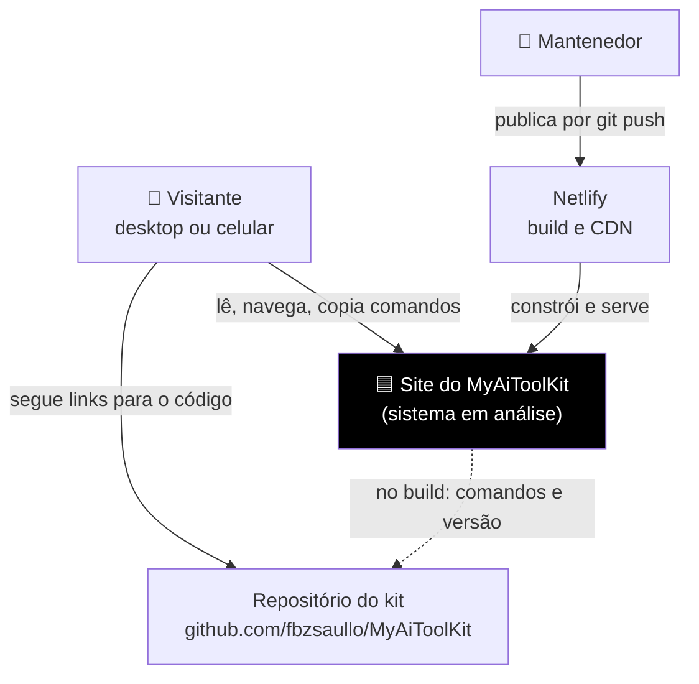
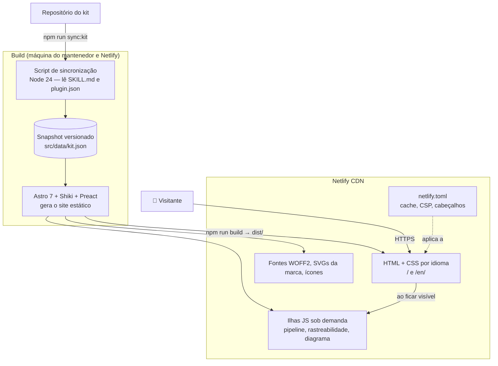
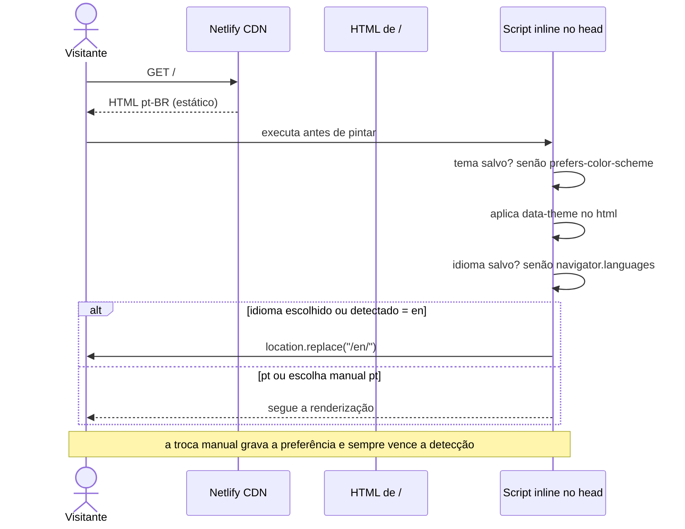
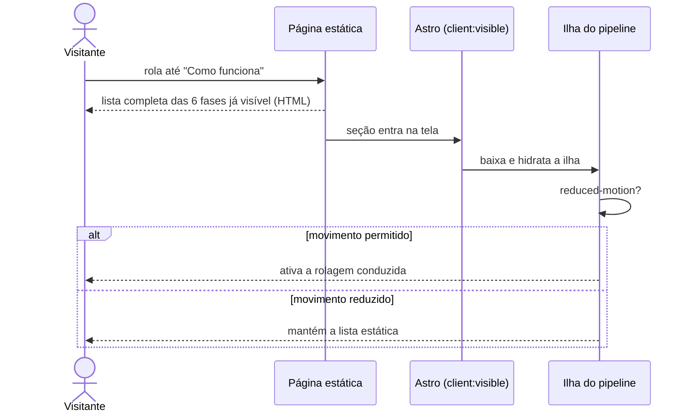

# Proposta Arquitetural — Site do MyAiToolKit

> Responsável: Fabrizio · Criada em 2026-10-06 · Versão 1.0 · Status: Aprovado

## 1. Resumo para decisão

- **O que será construído:** a landing page oficial do MyAiToolKit, uma página única bilíngue (pt-BR e en) que explica o kit, mostra o pipeline SDD funcionando com dois exemplos e leva o visitante à instalação.
- **Ideia central:** um site **estático**, gerado no build, que entrega HTML pronto e só carrega JavaScript nas três partes que realmente precisam de interação (pipeline, rastreabilidade e diagrama da arquitetura). Assim o site fica rápido, acessível, sem rastreadores e barato de manter.
- **Maiores riscos:** (1) a rolagem conduzida do pipeline estourar o orçamento de JavaScript ou prejudicar a acessibilidade; (2) o conteúdo dos comandos ficar desatualizado em relação ao kit; (3) a detecção automática de idioma conflitar com a escolha manual. Cada um tem resposta nas decisões abaixo (ADR-003, ADR-004, ADR-007 e ADR-008).
- **Restrições informadas:** Astro, hospedagem na Netlify, nenhum serviço de terceiros, nenhum cookie, fontes hospedadas no próprio site, identidade 100% monocromática e marca imutável (seção 4). Esta proposta não calcula esforço nem prazo.

---

## 2. Negócio

### 2.1 O problema
O MyAiToolKit só existe hoje como repositório no GitHub. Quem chega por um link precisa ler um README longo para entender o que é SDD, o que cada comando faz e como as fases se ligam. Sem uma página que mostre isso de forma visual e rápida, o projeto perde quem chega curioso e não tem paciência para documentação.

### 2.2 Resultados esperados
- Em 5 segundos, o visitante entende o que o kit é.
- O visitante vê o pipeline acontecendo com um exemplo concreto, e não só uma lista de comandos.
- O visitante encontra e copia o comando de instalação certo para a sua IA.
- O próprio site serve de prova de conceito: ele foi construído com o kit, e os documentos ficam publicados no repositório.

### 2.3 Fora do escopo
- Estatísticas de acesso, cookies, banner de consentimento ou qualquer script de terceiros.
- Métricas do GitHub (estrelas, downloads, contribuidores).
- Backend, banco de dados, formulários, login ou CMS.
- Documentação completa do kit (o site aponta para o repositório).
- Idiomas além de pt-BR e en.

### 2.4 Público e volume
Desenvolvedores que usam assistentes de IA de programação (Claude Code, Codex e outros), estudantes e avaliadores do projeto acadêmico. Volume esperado baixo a moderado (dezenas a milhares de visitas por mês), com picos pontuais quando o projeto é divulgado. Acesso por desktop e celular.

---

## 3. Qualidades que dirigem a arquitetura

### 3.1 Desempenho
- **Meta:** LCP abaixo de 2 s em 4G; menos de 50 KB de JavaScript no carregamento inicial; CLS perto de 0; Lighthouse de pelo menos 95 nas quatro categorias no celular.
- **Motivo:** uma landing page lenta perde o visitante antes de ele entender o produto.
- **Resposta da arquitetura:** HTML estático, CSS próprio, JavaScript só em ilhas carregadas quando ficam visíveis, realce de código feito no build (ADR-001, ADR-003, ADR-005).

### 3.2 Acessibilidade
- **Meta:** WCAG 2.2 AA, navegação completa por teclado, `prefers-reduced-motion` respeitado em tudo, leitores de tela recebendo o conteúdo completo das animações.
- **Motivo:** o site explica uma ferramenta de desenvolvimento para qualquer pessoa; animação sem alternativa excluiria parte do público, e o projeto é acadêmico e aberto.
- **Resposta da arquitetura:** cada parte interativa tem uma camada estática completa que funciona sem JavaScript; animações são progressivas (ADR-003, ADR-004).

### 3.3 Privacidade
- **Meta:** nenhuma requisição a terceiros, nenhum cookie, nenhum armazenamento além de preferências locais (tema e idioma).
- **Motivo:** o projeto não precisa de dados de visitantes, e não coletar nada elimina banner de consentimento e obrigações de LGPD.
- **Resposta da arquitetura:** fontes, ícones e scripts servidos pelo próprio site; CSP sem terceiros; preferências em `localStorage` (ADR-008, ADR-009, ADR-010, ADR-011).

### 3.4 Manutenibilidade do conteúdo
- **Meta:** o site não pode descrever comandos ou versão diferentes dos que o kit tem; trocar um texto não exige mexer em componente.
- **Motivo:** o kit vai evoluir, e um site desatualizado desinforma.
- **Resposta da arquitetura:** conteúdo em coleções por idioma e dados dos comandos sincronizados a partir dos `SKILL.md` e do `plugin.json` do kit (ADR-006, ADR-007).

Atendidas pelo padrão da plataforma: disponibilidade e escala (CDN da Netlify), segurança de infraestrutura (site estático sem backend).

---

## 4. Restrições

| Tipo | Restrição | De onde vem |
| --- | --- | --- |
| Tecnologia | Astro como gerador de site estático; Motion ou GSAP para a rolagem conduzida; Shiki para código | Demanda do responsável |
| Infraestrutura | Hospedagem na Netlify, com `netlify.toml` | Demanda do responsável |
| Privacidade | Nenhum script, fonte ou CDN de terceiros; nenhum cookie; nenhuma estatística de acesso | Demanda do responsável |
| Marca | Logo sempre no SVG original, sem alteração; ícone MA/TK só no navegador; arquivos de `brand/` imutáveis | Identidade visual definida |
| Visual | Site 100% monocromático, sem cor de destaque nem cores semânticas; tokens de cor definidos | Identidade visual definida |
| Tipografia | Geist e Geist Mono, hospedadas no site em WOFF2 (latin e latin-ext) | Identidade visual definida |
| Idiomas | pt-BR em `/` e en em `/en/`, com detecção no primeiro acesso e troca manual lembrada | Demanda do responsável |
| Qualidade | WCAG 2.2 AA; metas de desempenho da seção 3.1 | Demanda do responsável |
| Processo | Construído com o próprio MyAiToolKit; um commit por tarefa, só com a autoria do responsável | Demanda do responsável |

---

## 5. Decisões arquiteturais

| ADR | Decisão | Status | Arquivo |
| --- | --- | --- | --- |
| ADR-001 | Site estático gerado com Astro | Aceito | [adrs/ADR-001-site-estatico-com-astro.md](adrs/ADR-001-site-estatico-com-astro.md) |
| ADR-002 | CSS próprio com tokens em variáveis, sem framework de CSS | Aceito | [adrs/ADR-002-css-proprio-com-tokens.md](adrs/ADR-002-css-proprio-com-tokens.md) |
| ADR-003 | Ilhas interativas em Preact, carregadas com `client:visible`, só em três seções | Aceito | [adrs/ADR-003-ilhas-preact-sob-demanda.md](adrs/ADR-003-ilhas-preact-sob-demanda.md) |
| ADR-004 | Animações com Motion e CSS, sempre progressivas e desligáveis | Aceito | [adrs/ADR-004-animacoes-com-motion.md](adrs/ADR-004-animacoes-com-motion.md) |
| ADR-005 | Realce de código com Shiki no build, com tema monocromático próprio | Aceito | [adrs/ADR-005-shiki-no-build.md](adrs/ADR-005-shiki-no-build.md) |
| ADR-006 | Conteúdo em coleções do Astro por idioma, com os exemplos como dados compartilhados | Aceito | [adrs/ADR-006-conteudo-em-colecoes.md](adrs/ADR-006-conteudo-em-colecoes.md) |
| ADR-007 | Dados dos comandos e versão sincronizados do kit por script, com snapshot versionado | Aceito | [adrs/ADR-007-sincronizacao-com-o-kit.md](adrs/ADR-007-sincronizacao-com-o-kit.md) |
| ADR-008 | Idioma por rota, com detecção no primeiro acesso por script inline e `localStorage` | Aceito | [adrs/ADR-008-idioma-por-rota-e-script-inline.md](adrs/ADR-008-idioma-por-rota-e-script-inline.md) |
| ADR-009 | Tema do sistema com troca manual, aplicado antes da primeira pintura | Aceito | [adrs/ADR-009-tema-sem-piscar.md](adrs/ADR-009-tema-sem-piscar.md) |
| ADR-010 | Fontes Geist hospedadas no site via Fontsource | Aceito | [adrs/ADR-010-fontes-geist-locais.md](adrs/ADR-010-fontes-geist-locais.md) |
| ADR-011 | Netlify com cabeçalhos de cache e de segurança (CSP sem terceiros) | Aceito | [adrs/ADR-011-netlify-cache-e-seguranca.md](adrs/ADR-011-netlify-cache-e-seguranca.md) |
| ADR-012 | Testes com Playwright e axe, checagem de links e orçamento de JavaScript | Aceito | [adrs/ADR-012-testes-e-orcamentos.md](adrs/ADR-012-testes-e-orcamentos.md) |

O fio condutor: **o padrão é HTML estático pronto; tudo o que exige JavaScript é exceção justificada, carregada tarde e com alternativa estática.** As decisões de idioma, tema e fontes servem à mesma ideia de não depender de nada fora do próprio site.

---

## 6. Visão da arquitetura

> **Níveis usados:** 1 (contexto) e 2 (containers). O nível 3 ficou de fora: o site é um único artefato estático, e a organização interna dos componentes é detalhada no plano.

### 6.1 Contexto (C4 nível 1)

O visitante só conversa com o site; os links para o GitHub são navegação comum, sem script nem contador. O kit é fonte de dados **apenas no momento da sincronização** (ADR-007), nunca em tempo de execução.

### 6.2 Containers (C4 nível 2)

| Container | O que faz | Tecnologia | Por que |
| --- | --- | --- | --- |
| Script de sincronização | Lê nomes, descrições e versão do kit e grava um snapshot | Node 24, sem dependência externa | O build da Netlify não depende de rede nem de outro repositório (ADR-007) |
| Gerador | Monta as duas versões da página, realça código e empacota as ilhas | Astro 7, Shiki, Preact | Saída estática com ilhas (ADR-001, ADR-003, ADR-005) |
| Páginas | HTML e CSS de `/` e `/en/` | HTML, CSS com tokens | Carregamento rápido e legível sem JavaScript (ADR-002) |
| Ilhas | Pipeline com rolagem conduzida, rastreabilidade clicável, diagrama interativo | Preact + Motion | Únicas partes que precisam de estado (ADR-003, ADR-004) |
| Ativos | Fontes, logo, ícones do navegador | WOFF2, SVG, PNG | Tudo local, sem terceiros (ADR-010) |
| Regras de entrega | Cache, CSP e cabeçalhos de segurança | `netlify.toml` | Política versionada junto com o código (ADR-011) |

---

## 7. Fluxos que merecem desenho

### 7.1 Primeiro acesso: idioma e tema antes da primeira pintura

O redirecionamento acontece no navegador, e não na CDN, para que a escolha manual (guardada sem cookie) sempre prevaleça — ver ADR-008.

### 7.2 Uma ilha ganhando vida

Quem não tem JavaScript, ou pediu movimento reduzido, recebe o mesmo conteúdo — só sem a coreografia.

---

## 8. Trade-offs aceitos

- **Desempenho × riqueza visual:** ficamos com desempenho. Animações só onde explicam algo, com JS carregado tarde. O preço é não ter efeitos "decorativos" que outras landing pages usam — que de todo modo a identidade proíbe.
- **Atualização automática × build independente:** ficamos com build independente. O snapshot dos comandos é atualizado por um script e versionado, em vez de buscado a cada build. O preço é precisar rodar `npm run sync:kit` quando o kit mudar (com checagem no CI que avisa).
- **Detecção de idioma na CDN × escolha manual sem cookie:** ficamos com a escolha manual. Detectar no navegador custa um redirecionamento extra para visitantes de outros idiomas no primeiro acesso, mas garante que quem escolheu português nunca seja mandado para o inglês.
- **Biblioteca de UI × JavaScript puro nas ilhas:** ficamos com Preact. São alguns KB a mais que JS puro, em troca de estado legível e testável nas três partes mais complexas.

---

## 9. Dívidas técnicas conscientes

- **Snapshot manual do kit**
  - **Vira problema quando:** o kit lançar versões com frequência e alguém esquecer de sincronizar.
  - **Caminho para quitar:** automatizar a sincronização com um workflow agendado ou um gatilho no repositório do kit.
- **Conteúdo bilíngue mantido à mão**
  - **Vira problema quando:** os textos crescerem a ponto de as versões divergirem.
  - **Caminho para quitar:** teste que compara as chaves de conteúdo dos dois idiomas (já previsto no ADR-012) e, se preciso, um fluxo de tradução.
- **Exemplos fictícios escritos à mão**
  - **Vira problema quando:** os formatos de ID do kit mudarem.
  - **Caminho para quitar:** validar os IDs dos exemplos com as expressões regulares do `templates/id-conventions.md` no teste.

---

## 10. Riscos

| Risco | Impacto | Probabilidade | Resposta |
| --- | --- | --- | --- |
| Rolagem conduzida pesada estourar o orçamento de JS ou o CLS | Alto | Média | Ilha carregada só ao ficar visível, Motion importado por função, orçamento verificado no build (ADR-012) |
| Rolagem conduzida dificultar teclado e leitor de tela | Alto | Média | Camada estática completa por baixo, desligamento com reduced-motion, testes com axe e teclado |
| Diagrama da arquitetura ficar ilegível no celular | Médio | Média | Versão em acordeão no celular (SPEC-UI) |
| Comandos do site divergirem do kit | Médio | Média | Snapshot sincronizado + checagem no CI |
| Sintaxe de cabeçalhos ou redirecionamentos da Netlify mudar | Baixo | Baixa | Configuração versionada e testada no deploy de prévia |
| Domínio próprio ainda não existe | Baixo | Alta | URL provisória `myaitoolkit.netlify.app` (premissa abaixo); trocar depois é uma linha de configuração |

> ⚠️ **Premissa:** ainda não há domínio próprio. Por decisão do responsável (2026-10-06), o endereço base é `https://myaitoolkit.netlify.app`, usado em `hreflang`, `canonical` e sitemap. Quando houver domínio, a troca exige alterar uma única configuração (`site` no `astro.config`).

---

## 11. Próximos passos de validação

1. PRD com as seções, as duas demandas de exemplo e os critérios de aceite (`/sdd-prd`).
2. SPEC-UI com telas e estados das partes interativas, inclusive as versões de celular e de movimento reduzido (`/sdd-prototype`).
3. Prova técnica cedo: a ilha do pipeline com rolagem conduzida medida contra o orçamento de JS e o CLS (primeiras tarefas do plano).
4. Deploy de prévia na Netlify para validar CSP, cabeçalhos e redirecionamentos.

---

## 12. Fora deste documento

- Textos finais e exemplos fictícios → PRD e coleções de conteúdo.
- Telas, estados e versões responsivas → SPEC-UI.
- Ordem de construção e estimativas → plano (`/sdd-plan`).
- Dados acadêmicos (instituição, curso, autores, orientador) → fora do site, por decisão do responsável (2026-10-06).
