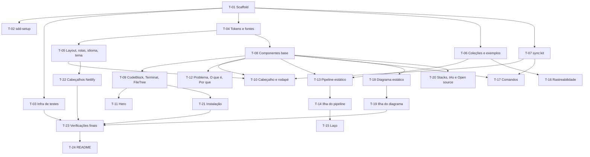

# PLAN-001: Landing page do MyAiToolKit

- **PRD:** `docs/sdd/prds/PRD-001-landing-page.md`
- **SPEC-UI:** `docs/sdd/prototype/SPEC-UI-001-landing-page.md`
- **Stack:** Node 24 · Astro 7 · Preact · Motion · Shiki · CSS próprio · Playwright + axe · Netlify
- **Responsável:** Fabrizio
- **Data:** 2026-10-06
- **Status:** Em execução
- **Estimativa total (informada pelo usuário):**

---

## 1. Resumo — obrigatória

Começa pela base técnica (projeto, configuração do kit, testes, tokens, rotas e conteúdo), depois constrói os componentes compartilhados, monta as seções na ordem da página — com as três ilhas interativas (pipeline, rastreabilidade, diagrama) em tarefas próprias — e termina com cabeçalhos de entrega e as verificações transversais (acessibilidade, privacidade, desempenho, links).

## 2. Como vai para produção — obrigatória

- **Modelo de entrega:** entrega única. O site só é publicado quando todas as tarefas estiverem `Concluído` com review aprovado.
- **Pronto significa:** todos os `CA-XX` do PRD com teste verde (`npm test`), orçamento de JS e checagem de links passando no build, `/sdd-trace` sem elos quebrados e build pronto para a Netlify.

## 3. Premissas e decisões — obrigatória quando houver

> ⚠️ **Premissa:** o responsável concedeu autonomia total (2026-10-06): as fases de documentação são aprovadas pelo executor e os pontos de validação humana viram autoverificação registrada no histórico.

> ⚠️ **Premissa:** o kit está disponível em `../MyAiToolKit` para a sincronização (ADR-007); o build não depende dele.

> ⚠️ **Premissa:** a estimativa por tarefa não foi informada pelo usuário; os campos `Estimativa` ficam vazios.

Decisões que moldam o plano: ADR-001 a ADR-012.

**Convenção de commits deste projeto:** um commit por tarefa após o review `Aprovado` ou `Aprovado com ressalvas`, mensagem `T-XX: descrição`, autoria só do responsável, sem menção a IA; push após cada commit.

**Convenção de testes:** Playwright, arquivos em `tests/`, `test("CA-XX: …")` para cenários do PRD (perfil Node do kit).

## 4. Dependências — obrigatória com mais de 5 tarefas

## 5. Fases — obrigatória

### Fase 1 — Base

- **Objetivo:** projeto funcionando com tokens, rotas nos dois idiomas, conteúdo modelado e testes prontos para receber cenários.
- **Fecha quando:** `npm run build` e `npm test` passam com as rotas `/` e `/en/` vazias de seções mas completas de `<head>`.

---

#### T-01 — Criar o projeto Astro com Preact e a cópia dos ícones da marca

- **Status:** Concluído
- **Complexidade:** Baixa
- **Estimativa:**
- **Depende de:** nenhuma
- **Implementa:** —
- **Valida:** —
- **Decisões base:** ADR-001, ADR-003, ADR-011
- **Arquivos/camadas:**
  - `package.json`, `package-lock.json`, `astro.config.mjs`, `tsconfig.json` *(novos)*
  - `scripts/copy-brand.mjs` *(novo — copia `brand/icons/*` para `public/`)*
  - `netlify.toml` *(novo — build, publish e Node 24)*
  - `.gitignore`, `.nvmrc` *(novos)*
  - `src/pages/index.astro` *(novo — página mínima)*

**O que fazer:**
Projeto Astro 7 estático com `@astrojs/preact`, TypeScript estrito, `site: https://myaitoolkit.netlify.app`. Script `prebuild`/`predev` copia os ícones de `brand/icons/` para `public/` sem alterar os arquivos (o `head-snippet.html` aponta para a raiz). `public/` copiado fica no `.gitignore`.

**Critério de aceite (testável):**
- [x] `npm run dev` e `npm run build` funcionam e geram `dist/`
- [x] `dist/favicon.ico`, `dist/site.webmanifest` e `dist/icon-512.png` são idênticos aos de `brand/icons/`

**Testes a escrever:**
- *Não se aplica* — estrutura. A verificação de cópia byte a byte entra no script como checagem.

**Riscos / atenção:**
- Astro 7 é recente: conferir a API de i18n e de coleções na documentação da versão instalada.

---

#### T-02 — Configurar o projeto com o `/sdd-setup` do kit

- **Status:** Concluído
- **Complexidade:** Baixa
- **Estimativa:**
- **Depende de:** T-01
- **Implementa:** —
- **Valida:** —
- **Decisões base:** —
- **Arquivos/camadas:**
  - `docs/sdd/config.yml`, `docs/sdd/stack-report.md` *(novos)*
  - `AGENTS.md`, `CLAUDE.md` *(novos)*
  - `.claude/settings.json`, `.codex/config.toml`, `.codex/rules/myaitoolkit.rules` *(novos)*

**O que fazer:**
Rodar o roteiro do `sdd-setup` com o perfil Node: versões reais (Node, Astro, Preact), comandos do `package.json`, convenção de teste `test("CA-XX: …")`, `git commit` **permitido** (decisão da demanda), migrations não se aplicam. IAs: Claude Code e Codex.

**Critério de aceite (testável):**
- [x] `config.yml` tem stacks, versões com origem, comandos existentes e `testing.ca_naming`
- [x] `AGENTS.md` com marcadores `myaitoolkit:start/end`; `CLAUDE.md` importa `@AGENTS.md`

**Testes a escrever:**
- *Não se aplica* — configuração.

---

#### T-03 — Montar a infraestrutura de testes, links e orçamento de JavaScript

- **Status:** Concluído
- **Complexidade:** Média
- **Estimativa:**
- **Depende de:** T-01
- **Implementa:** —
- **Valida:** —
- **Decisões base:** ADR-012
- **Arquivos/camadas:**
  - `playwright.config.ts` *(novo — servidor `astro preview`, projetos desktop e celular)*
  - `tests/helpers.ts` *(novo — emulação de idioma, tema, movimento; axe)*
  - `scripts/check-budget.mjs` *(novo)*, `scripts/check-links.mjs` *(novo)*
  - `package.json` *(scripts `test`, `test:e2e`, `check:budget`, `check:links`)*

**O que fazer:**
Playwright contra o build. Orçamento: soma (gzip) do JS referenciado pelo HTML antes de interação; falha acima de 50 KB; ilhas medidas à parte. Links: verificação de âncoras internas e caminhos de `dist/` sem rede; links externos só do domínio esperado.

**Critério de aceite (testável):**
- [x] `npm test` roda build, orçamento, links e Playwright em sequência
- [x] Um teste de fumaça abre `/` e `/en/` com status 200

**Testes a escrever:**
- *E2E:* `test("rotas respondem")`

---

#### T-04 — Criar tokens, fontes, tipografia e estilos globais

- **Status:** Concluído
- **Complexidade:** Média
- **Estimativa:**
- **Depende de:** T-01
- **Implementa:** RN-02
- **Valida:** —
- **Decisões base:** ADR-002, ADR-013
- **Arquivos/camadas:**
  - `src/styles/tokens.css`, `src/styles/fonts.css`, `src/styles/global.css` *(novos)*

**O que fazer:**
Nove tokens de cor (claro/escuro por `prefers-color-scheme` e `[data-theme]`), escala tipográfica com `clamp()`, tokens de espaço, raio e movimento, grid aparente, foco visível 2 px + 2 px, link de pular conteúdo, `tabular-nums`. Fontes Geist/Geist Mono via Fontsource (pesos usados, latin + latin-ext, `swap`), preload só de Geist 600 latin.

**Critério de aceite (testável):**
- [x] Nenhuma cor fora dos tokens em `src/` (checagem por busca)
- [x] Build contém só `.woff2` das fontes, latin e latin-ext

**Testes a escrever:**
- *E2E:* `test("fontes servidas localmente em woff2")`

---

#### T-05 — Montar layout, rotas pt-BR e en, `<head>` e o script inline de idioma e tema

- **Status:** Concluído
- **Complexidade:** Alta
- **Estimativa:**
- **Depende de:** T-04
- **Implementa:** RN-06, RN-07
- **Valida:** CA-04, CA-05, CA-07
- **Decisões base:** ADR-008, ADR-009
- **Arquivos/camadas:**
  - `src/layouts/Base.astro` *(novo)*
  - `src/scripts/boot.inline.js` *(novo)*
  - `src/pages/index.astro`, `src/pages/en/index.astro` *(novos)*
  - `src/i18n/` *(novo — utilitários de idioma e rotas)*
  - `tests/i18n.spec.ts` *(novo)*

**O que fazer:**
Layout com `lang`, `hreflang` (pt-BR, en, x-default com URL absoluta), `head-snippet.html`, `color-scheme`, script inline síncrono que aplica `data-theme` e decide o idioma (salvo > navegador). Utilitário de troca que grava `matk-lang`/`matk-theme`.

**Critério de aceite (testável):**
- [x] CA-04 verde: navegador en-US em `/` vai para `/en/`
- [x] CA-05 verde: navegador pt-BR fica em `/`
- [x] CA-07 verde: `lang` e `hreflang` corretos nas duas rotas

**Testes a escrever:**
- *E2E:* `test("CA-04: …")`, `test("CA-05: …")`, `test("CA-07: …")`

**Riscos / atenção:**
- O script inline precisa ser estável para o hash da CSP (T-22).

---

#### T-06 — Modelar as coleções de conteúdo e os dados das duas demandas fictícias

- **Status:** Concluído
- **Complexidade:** Média
- **Estimativa:**
- **Depende de:** T-01
- **Implementa:** RN-05
- **Valida:** —
- **Decisões base:** ADR-006
- **Arquivos/camadas:**
  - `src/content.config.ts` *(novo)*
  - `src/content/ui/pt-BR.json`, `src/content/ui/en.json` *(novos)*
  - `src/content/examples/*.json` *(novos — estrutura e IDs únicos; textos por idioma)*
  - `tests/content.spec.ts` *(novo)*

**O que fazer:**
Esquemas para textos de interface e para as demandas (fases, documentos, IDs, ligações pai-filho, tarefas, review, teste). Conteúdo do Anexo A do PRD.

**Critério de aceite (testável):**
- [x] pt-BR e en têm exatamente as mesmas chaves
- [x] Todos os IDs dos exemplos seguem os formatos do kit (`ADR-XXX`, `RN-XX`, `CA-XX`, `UI-XX.estado`, `T-XX`, `R-XX (REVIEW-T-XX-AAAA-MM-DD)`)

**Testes a escrever:**
- *Conteúdo:* `test("idiomas com as mesmas chaves")`, `test("IDs no formato do kit")`

---

#### T-07 — Sincronizar comandos e versão do kit em um snapshot

- **Status:** Concluído
- **Complexidade:** Baixa
- **Estimativa:**
- **Depende de:** T-01
- **Implementa:** RN-13
- **Valida:** —
- **Decisões base:** ADR-007
- **Arquivos/camadas:**
  - `scripts/sync-kit.mjs` *(novo)*, `src/data/kit.json` *(novo)*
  - `tests/kit.spec.ts` *(novo)*

**O que fazer:**
Script sem dependências: lê `KIT_PATH` (padrão `../MyAiToolKit`) ou clona `KIT_REPO`; extrai `name`/`description` dos `SKILL.md` e `version` do `plugin.json`; grava o snapshot.

**Critério de aceite (testável):**
- [x] Snapshot com 12 comandos e versão `0.1.0`
- [x] Teste avisa se o snapshot divergir do kit disponível

**Testes a escrever:**
- *Conteúdo:* `test("snapshot do kit com 12 comandos")`

### Fase 2 — Componentes e seções

- **Objetivo:** página completa, seção por seção, cada uma com suas camadas estática e interativa.
- **Fecha quando:** todas as telas UI-01…UI-13 existem nos dois idiomas com seus estados.

---

#### T-08 — Construir os componentes base e os ícones

- **Status:** Concluído
- **Complexidade:** Média
- **Estimativa:**
- **Depende de:** T-04
- **Implementa:** RN-01, RN-02
- **Valida:** —
- **Decisões base:** ADR-002
- **Telas:** componentes de UI-01…UI-13 (`Logo`, `Section`, `IdTag`, `CommandChip`, `Callout`, `StackBadge`, `PhaseIcon`)
- **Arquivos/camadas:**
  - `src/components/*.astro` *(novos)*
  - `src/icons/` *(novo — 6 ícones de fase + Lucide inline)*

**Critério de aceite (testável):**
- [x] Logo usa os SVGs de `brand/` sem alteração, preto no claro e branco no escuro
- [x] Ícones com traço quadrado, `miter`, 1,75 px em 24 px

**Testes a escrever:**
- *E2E:* `test("logo troca com o tema")`

---

#### T-09 — Construir CodeBlock com Shiki e copiar, Terminal e FileTree

- **Status:** Concluído
- **Complexidade:** Média
- **Estimativa:**
- **Depende de:** T-08
- **Implementa:** RN-15
- **Valida:** —
- **Decisões base:** ADR-005
- **Telas:** `CodeBlock` (default, copiado, erroCopia), `Terminal`, `FileTree`
- **Arquivos/camadas:**
  - `src/lib/shiki-theme.ts`, `src/components/CodeBlock.astro`, `src/components/Terminal.astro`, `src/components/FileTree.astro` *(novos)*
  - `src/scripts/copy.ts` *(novo)*

**Critério de aceite (testável):**
- [x] Realce monocromático por variáveis; `/sdd-*` sublinhado
- [x] Copiar grava o texto exato e mostra ■ → ✓ com anúncio

**Testes a escrever:**
- *E2E:* cobertos pelo CA-20 na T-21

---

#### T-10 — Montar cabeçalho e rodapé

- **Status:** Concluído
- **Complexidade:** Média
- **Estimativa:**
- **Depende de:** T-05, T-07, T-08
- **Implementa:** RN-01, RN-06, RN-07, RN-12, RN-13
- **Valida:** CA-06, CA-08
- **Decisões base:** ADR-008, ADR-009
- **Telas:** UI-01 (default, celular, menuAberto, secaoAtiva, semJs), UI-13 (default, celular)
- **Arquivos/camadas:**
  - `src/components/Header.astro`, `src/components/Footer.astro`, `src/scripts/header.ts` *(novos)*
  - `tests/header-footer.spec.ts` *(novo)*

**Critério de aceite (testável):**
- [x] CA-06 verde: escolha manual de idioma vence a detecção
- [x] CA-08 verde: tema do sistema e escolha manual sem piscar
- [x] Rodapé mostra a versão do snapshot

**Testes a escrever:**
- *E2E:* `test("CA-06: …")`, `test("CA-08: …")`

---

#### T-11 — Construir o hero com o terminal animado

- **Status:** Concluído
- **Complexidade:** Média
- **Estimativa:**
- **Depende de:** T-09, T-10
- **Implementa:** RN-01, RN-08
- **Valida:** CA-01, CA-02
- **Decisões base:** ADR-004
- **Telas:** UI-02 (digitando, arvore, completo, pausado, reduzido)
- **Arquivos/camadas:**
  - `src/sections/Hero.astro`, `src/scripts/hero.ts` *(novos)*
  - `tests/hero.spec.ts` *(novo)*

**Critério de aceite (testável):**
- [x] CA-01 e CA-02 verdes
- [x] Animação com pausar e repetir; leitor de tela recebe o texto completo

**Testes a escrever:**
- *E2E:* `test("CA-01: …")`, `test("CA-02: …")`

---

#### T-12 — Montar as seções O problema, O que é e Por que assim

- **Status:** Concluído
- **Complexidade:** Baixa
- **Estimativa:**
- **Depende de:** T-08
- **Implementa:** RN-08
- **Valida:** —
- **Decisões base:** ADR-004
- **Telas:** UI-03 (default, reduzido, celular), UI-04, UI-08
- **Arquivos/camadas:**
  - `src/sections/Problem.astro`, `src/sections/WhatIs.astro`, `src/sections/Why.astro` *(novos)*

**Critério de aceite (testável):**
- [x] Alternância do problema roda uma vez e vira lista com movimento reduzido

**Testes a escrever:**
- *E2E:* `test("problema vira lista com movimento reduzido")`

---

#### T-13 — Montar a camada estática do pipeline

- **Status:** Concluído
- **Complexidade:** Média
- **Estimativa:**
- **Depende de:** T-06, T-08
- **Implementa:** RN-05
- **Valida:** —
- **Decisões base:** ADR-003
- **Telas:** UI-05 (reduzido, semJs)
- **Arquivos/camadas:**
  - `src/sections/Pipeline.astro` *(novo)*

**O que fazer:**
As 6 fases como lista completa (comando, entrada, documento, IDs), para as duas demandas, fase 3 opcional — é o que existe sem JS e com movimento reduzido.

**Critério de aceite (testável):**
- [x] Sem JS, as duas demandas aparecem completas

**Testes a escrever:**
- *E2E:* `test("pipeline completo sem JavaScript")`

---

#### T-14 — Criar a ilha do pipeline com seletor e rolagem conduzida

- **Status:** Concluído
- **Complexidade:** Alta
- **Estimativa:**
- **Depende de:** T-13
- **Implementa:** RN-02, RN-05, RN-08, RN-12
- **Valida:** CA-09, CA-10
- **Decisões base:** ADR-003, ADR-004
- **Telas:** UI-05 (novoProjeto, recuperacao, faseAtiva, opcional, celular)
- **Arquivos/camadas:**
  - `src/components/islands/PipelineIsland.tsx` *(novo)*
  - `src/lib/motion.ts` *(novo — utilitários e reduced-motion)*
  - `tests/pipeline.spec.ts` *(novo)*

**Critério de aceite (testável):**
- [x] CA-09 e CA-10 verdes
- [x] Sem salto de layout na hidratação; ilha dentro do orçamento

**Testes a escrever:**
- *E2E:* `test("CA-09: …")`, `test("CA-10: …")`

**Riscos / atenção:**
- Plano B do PRD: destaque por `IntersectionObserver` sem `sticky` se o CLS ou o orçamento estourarem.

---

#### T-15 — Criar o laço execução ⇄ review

- **Status:** Concluído
- **Complexidade:** Média
- **Estimativa:**
- **Depende de:** T-14
- **Implementa:** RN-08
- **Valida:** CA-11
- **Decisões base:** ADR-004
- **Telas:** UI-05 (laco, lacoPausado)
- **Arquivos/camadas:**
  - `src/components/islands/LoopIsland.tsx` *(novo)*
  - `tests/loop.spec.ts` *(novo)*

**Critério de aceite (testável):**
- [x] CA-11 verde, com pausar e repetir

**Testes a escrever:**
- *E2E:* `test("CA-11: …")`

---

#### T-16 — Construir a rastreabilidade com cadeia clicável e mini matriz

- **Status:** Concluído
- **Complexidade:** Média
- **Estimativa:**
- **Depende de:** T-06, T-08
- **Implementa:** RN-02, RN-05, RN-10
- **Valida:** CA-12, CA-13
- **Decisões base:** ADR-003
- **Telas:** UI-06 (default, foco, eloQuebrado, semJs, celular)
- **Arquivos/camadas:**
  - `src/sections/Traceability.astro`, `src/components/islands/TraceIsland.tsx` *(novos)*
  - `tests/trace.spec.ts` *(novo)*

**Critério de aceite (testável):**
- [x] CA-12 e CA-13 verdes

**Testes a escrever:**
- *E2E:* `test("CA-12: …")`, `test("CA-13: …")`

---

#### T-17 — Construir a referência dos comandos com prévia

- **Status:** Pendente
- **Complexidade:** Média
- **Estimativa:**
- **Depende de:** T-07, T-08
- **Implementa:** RN-03, RN-04
- **Valida:** CA-14, CA-15
- **Decisões base:** ADR-007
- **Telas:** UI-07 (default, previa, celular)
- **Arquivos/camadas:**
  - `src/sections/Commands.astro` *(novo)*
  - `tests/commands.spec.ts` *(novo)*

**Critério de aceite (testável):**
- [ ] CA-14 e CA-15 verdes; lista igual ao snapshot

**Testes a escrever:**
- *E2E:* `test("CA-14: …")`, `test("CA-15: …")`

---

#### T-18 — Desenhar o diagrama da arquitetura estático e o acordeão do celular

- **Status:** Pendente
- **Complexidade:** Média
- **Estimativa:**
- **Depende de:** T-08
- **Implementa:** RN-10, RN-12
- **Valida:** CA-17
- **Decisões base:** ADR-003
- **Telas:** UI-09 (default, semJs, celular)
- **Arquivos/camadas:**
  - `src/sections/Architecture.astro`, `src/components/ArchitectureDiagram.astro` *(novos)*
  - `tests/architecture.spec.ts` *(novo)*

**Critério de aceite (testável):**
- [ ] CA-17 verde: SVG com texto real e lista equivalente sem JS

**Testes a escrever:**
- *E2E:* `test("CA-17: …")`

---

#### T-19 — Criar a ilha do diagrama com seleção, painel e "Ver o fluxo"

- **Status:** Pendente
- **Complexidade:** Alta
- **Estimativa:**
- **Depende de:** T-18
- **Implementa:** RN-08, RN-10
- **Valida:** CA-16, CA-18
- **Decisões base:** ADR-003, ADR-004
- **Telas:** UI-09 (selecionado, fluxo, pausado, reduzido)
- **Arquivos/camadas:**
  - `src/components/islands/ArchitectureIsland.tsx` *(novo)*
  - `tests/architecture.spec.ts` *(editado)*

**Critério de aceite (testável):**
- [ ] CA-16 e CA-18 verdes, inclusive com teclado

**Testes a escrever:**
- *E2E:* `test("CA-16: …")`, `test("CA-18: …")`

---

#### T-20 — Montar Stacks e IAs e a seção Open source

- **Status:** Pendente
- **Complexidade:** Média
- **Estimativa:**
- **Depende de:** T-08
- **Implementa:** RN-03, RN-14
- **Valida:** CA-25
- **Decisões base:** ADR-004
- **Telas:** UI-10 (default, reduzido, celular), UI-12 (default, celular)
- **Arquivos/camadas:**
  - `src/sections/StacksAndAIs.astro`, `src/sections/OpenSource.astro` *(novos)*
  - `tests/footer-open-source.spec.ts` *(novo)*

**Critério de aceite (testável):**
- [ ] CA-25 verde: versão, links e bloco "feito com o MyAiToolKit"
- [ ] Cursor e "outras" nunca rotulados como suportados

**Testes a escrever:**
- *E2E:* `test("CA-25: …")`

---

#### T-21 — Construir a instalação com abas e botão copiar

- **Status:** Pendente
- **Complexidade:** Média
- **Estimativa:**
- **Depende de:** T-09
- **Implementa:** RN-03, RN-10, RN-15
- **Valida:** CA-19, CA-20
- **Decisões base:** ADR-005
- **Telas:** UI-11 (claude, codex, outras, copiado, erroCopia, semJs)
- **Arquivos/camadas:**
  - `src/sections/Install.astro`, `src/scripts/tabs.ts` *(novos)*
  - `tests/install.spec.ts` *(novo)*

**Critério de aceite (testável):**
- [ ] CA-19 e CA-20 verdes

**Testes a escrever:**
- *E2E:* `test("CA-19: …")`, `test("CA-20: …")`

### Fase 3 — Entrega e qualidade

- **Objetivo:** site pronto para a Netlify, com as verificações transversais verdes.
- **Fecha quando:** `npm test` inteiro verde e `/sdd-trace` sem elos quebrados.

---

#### T-22 — Configurar cabeçalhos da Netlify, CSP com hash e páginas 404

- **Status:** Pendente
- **Complexidade:** Média
- **Estimativa:**
- **Depende de:** T-05
- **Implementa:** RN-09
- **Valida:** —
- **Decisões base:** ADR-011
- **Arquivos/camadas:**
  - `netlify.toml` *(editado)*, `scripts/csp-hash.mjs` *(novo)*
  - `src/pages/404.astro`, `src/pages/en/404.astro` *(novos)*

**Critério de aceite (testável):**
- [ ] CSP sem terceiros com o hash do script inline gerado no build
- [ ] Cache imutável em `/_astro/*`

**Testes a escrever:**
- *Build:* `test("CSP contém o hash do script inline")`

---

#### T-23 — Fechar as verificações transversais

- **Status:** Pendente
- **Complexidade:** Média
- **Estimativa:**
- **Depende de:** T-03, T-19, T-21, T-22
- **Implementa:** RN-08, RN-09, RN-10, RN-11, RN-12
- **Valida:** CA-03, CA-21, CA-22, CA-23, CA-24, CA-26
- **Decisões base:** ADR-012
- **Arquivos/camadas:**
  - `tests/quality.spec.ts` *(novo)*

**Critério de aceite (testável):**
- [ ] CA-03, CA-21, CA-22, CA-23, CA-24 e CA-26 verdes

**Testes a escrever:**
- *E2E:* `test("CA-03: …")`, `test("CA-21: …")`, `test("CA-22: …")`, `test("CA-23: …")`, `test("CA-24: …")`, `test("CA-26: …")`

---

#### T-24 — Escrever o README do site

- **Status:** Pendente
- **Complexidade:** Baixa
- **Estimativa:**
- **Depende de:** T-23
- **Implementa:** —
- **Valida:** —
- **Decisões base:** ADR-011
- **Arquivos/camadas:**
  - `README.md` *(novo)*

**Critério de aceite (testável):**
- [ ] Como rodar, como publicar na Netlify e o aviso "feito com o MyAiToolKit" com link para `docs/sdd/`

**Testes a escrever:**
- *Não se aplica* — coberto pela checagem de links (CA-26).

> **Status aceitos (texto exato):** `Pendente` | `Em andamento` | `Concluído` | `Bloqueado`.

## 6. Testes que atravessam tarefas (opcional)

- [ ] Lighthouse manual no celular (≥ 95 nas quatro categorias) antes de publicar

## 7. Pronto para produção — obrigatória

- [ ] Todos os `CA-XX` verdes
- [ ] Orçamento de JS e links verdes no build
- [ ] Reviews aprovados para todas as tarefas
- [ ] `/sdd-trace` sem elos quebrados
- [ ] `README.md` com instruções da Netlify

## 8. Reversão

Não há migration nem dados. Reverter é publicar o deploy anterior na Netlify.

## 9. Pontos de validação humana — obrigatória

Autonomia concedida pelo responsável: viram autoverificações registradas no histórico.

- [x] Depois da **T-05** — conferir na prática que não há flash de tema nem de idioma
- [x] Depois da **T-14** — medir o JS da ilha e o CLS antes de seguir para as demais ilhas
- [ ] Antes da **T-24** — revisar a página inteira nos dois idiomas e temas

## 10. Pontos em aberto (opcional)

- [ ] Domínio definitivo (hoje `myaitoolkit.netlify.app`) — responsável: Fabrizio

## 11. Histórico de execução — preenchido durante a execução

| Tarefa | Status | Data | Commit | Observação |
| --- | --- | --- | --- | --- |
| T-01 | Concluído | 2026-10-06 | `693bda6` | Review aprovado com ressalvas (R-01 para a T-05) |
| T-02 | Concluído | 2026-10-06 | `e397a1a` | Review aprovado |
| T-03 | Concluído | 2026-10-06 | `0d2513f` | Aprovado com ressalvas: R-01 (/en/ na T-05), R-02 (404 na T-22) |
| T-04 | Concluído | 2026-10-06 | `f84e441` | Aprovado com ressalvas: R-01 (preload na T-05); fontes via ADR-013 |
| T-05 | Concluído | 2026-10-06 | `6beda28` | Aprovado com ressalvas: R-01 (CA-07 completado nas T-12 e T-17) |
| T-06 | Concluído | 2026-10-06 | `1e0915a` | Review aprovado |
| T-07 | Concluído | 2026-10-06 | `e0febd8` | Review aprovado |
| T-08 | Concluído | 2026-10-06 | `b3c2792` | Aprovado com ressalvas: R-01 (GitHub em texto) |
| T-09 | Concluído | 2026-10-06 | `fcf0dab` | Aprovado com ressalvas: R-01 (Terminal e FileTree testados na T-11) |
| T-10 | Concluído | 2026-10-06 | `8de2c69` | Aprovado com ressalvas: R-01 (seção ativa testada na T-23) |
| T-11 | Concluído | 2026-10-06 | `243a16a` | Review aprovado |
| T-12 | Concluído | 2026-10-06 | `44b44bf` | Review aprovado |
| T-13 | Concluído | 2026-10-06 | `aadd023` | Aprovado com ressalvas: R-01 (ilha criada já na T-13 para evitar CLS) |
| T-14 | Concluído | 2026-10-06 | `793fc82` | Review aprovado; ilha 12,4 KB, CLS < 0,02 |
| T-15 | Concluído | 2026-10-07 | `d29d2d3` | Aprovado com ressalvas: R-01 (laço vive dentro da ilha do pipeline) |
| T-16 | Concluído | 2026-10-07 | (ver T-17) | Review aprovado; ilha 8,3 KB |
