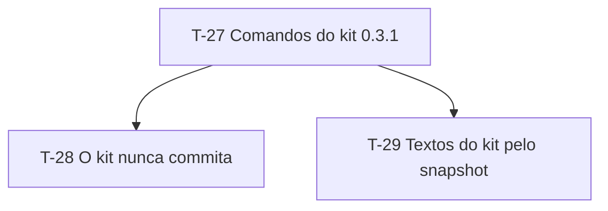

# PLAN-002: Site atualizado para o MyAiToolKit 0.3.1

- **PRD:** `docs/sdd/prds/PRD-002-site-kit-0-3-1.md`
- **SPEC-UI:** sem SPEC-UI própria — reaproveita UI-02, UI-07, UI-09, UI-11 e UI-12 de `docs/sdd/prototype/SPEC-UI-001-landing-page.md`
- **Stack:** Node 24 · Astro 7 · Preact · Motion · Shiki · CSS próprio · Playwright + axe · Netlify
- **Responsável:** Fabrizio
- **Data:** 2026-10-07
- **Status:** Em execução
- **Estimativa total (informada pelo usuário):**

---

## 1. Resumo — obrigatória

Três tarefas, uma por regra do PRD-002: primeiro o snapshot do kit 0.3.1 e a seção Comandos em quatro grupos (a base das outras duas), depois a explicação de que o kit nunca commita, e por fim os textos que descrevem o kit, com as contagens lidas do snapshot.

## 2. Como vai para produção — obrigatória

- **Modelo de entrega:** entrega única, como no PLAN-001.
- **Pronto significa:** CA-28, CA-29 e CA-30 com teste verde; `npm test` inteiro verde (os cenários do PRD-001 continuam valendo); `/sdd-trace` sem elos quebrados no PRD-002 e no PRD-001 revisado.

## 3. Premissas e decisões — obrigatória quando houver

> ⚠️ **Premissa:** a numeração continua a do projeto — tarefas a partir de T-27, regras a partir de RN-17, cenários a partir de CA-28 (decisão do responsável, 2026-10-07).

> ⚠️ **Premissa:** o padrão do kit 0.2.0 é o agente não commitar, mas o responsável autorizou o agente a commitar e dar push neste projeto (2026-10-07): um commit por tarefa, depois do review aprovado, com a mensagem que o review entrega. O hash de cada tarefa entra no histórico no commit da tarefa seguinte.

> ⚠️ **Premissa:** o kit 0.3.1 está em `../MyAiToolKit` (commit `e283458`) para a sincronização (ADR-007).

> ⚠️ **Premissa:** a estimativa por tarefa não foi informada pelo usuário; os campos `Estimativa` ficam vazios.

Decisões que moldam o plano: ADR-007 (snapshot do kit).

## 4. Dependências — obrigatória com mais de 5 tarefas

## 5. Fases — obrigatória

### Fase 1 — Site no kit 0.3.1

- **Objetivo:** o site descreve exatamente o kit 0.3.1.
- **Fecha quando:** `npm test` inteiro verde e `/sdd-trace` sem elos quebrados.

---

#### T-27 — Sincronizar o snapshot do kit 0.3.1 e mostrar os comandos em quatro grupos

- **Status:** Pendente
- **Complexidade:** Média
- **Estimativa:**
- **Depende de:** —
- **Implementa:** RN-17
- **Valida:** CA-28
- **Decisões base:** ADR-007
- **Telas:** UI-07 (default, previa, celular) — da SPEC-UI-001
- **Arquivos/camadas:**
  - `src/data/kit.json` (`npm run sync:kit`), `src/lib/commands.ts`, `src/content/ui/*.json` *(editados)*
  - `tests/kit.spec.ts`, `tests/commands.spec.ts` *(editados)*

**Critério de aceite (testável):**
- [ ] Snapshot em 0.3.1 com 17 comandos; seção Comandos com Fases, Navegação, Mudança e Apoio, um chip por comando do snapshot, com quando usar, o que gera, chamada no Codex e prévia de 2 a 3 linhas

**Testes a escrever:**
- *E2E:* `test("CA-28: …")` — substitui o teste do CA-14 do PRD-001

---

#### T-28 — Explicar que o kit nunca commita

- **Status:** Pendente
- **Complexidade:** Baixa
- **Estimativa:**
- **Depende de:** T-27
- **Implementa:** RN-18
- **Valida:** CA-29
- **Decisões base:** —
- **Telas:** UI-07 (previa) — da SPEC-UI-001
- **Arquivos/camadas:**
  - `src/content/ui/*.json` *(editados — introdução da seção Comandos e prévias do `/sdd-execute` e do `/sdd-setup`)*
  - `tests/commands.spec.ts` *(editado)*

**Critério de aceite (testável):**
- [ ] A introdução da seção Comandos diz que o kit nunca commita nem abre PR; a prévia do `/sdd-execute` não sugere commit; as do `/commit-message` e do `/pr-description` mostram texto entregue

**Testes a escrever:**
- *E2E:* `test("CA-29: …")`, nos dois idiomas

---

#### T-29 — Ler do snapshot os textos que descrevem o kit

- **Status:** Pendente
- **Complexidade:** Baixa
- **Estimativa:**
- **Depende de:** T-27
- **Implementa:** RN-19
- **Valida:** CA-30
- **Decisões base:** ADR-007
- **Telas:** UI-02 (completo), UI-09 (default), UI-11 (claude), UI-12 (default) — da SPEC-UI-001
- **Arquivos/camadas:**
  - `src/lib/kit.ts` *(novo — contagem a partir do snapshot)*
  - `src/content/ui/*.json`, `src/components/ArchitectureDiagram.astro`, `src/sections/Install.astro`, `src/sections/OpenSource.astro` *(editados)*
  - `tests/kit.spec.ts` *(editado)*

**Critério de aceite (testável):**
- [ ] Terminal do hero com "A · B · C · D · E · F"; bloco Skills, conferência do `/plugin` e nota de `skills/` mostram a contagem do snapshot, sem número escrito à mão nos textos

**Testes a escrever:**
- *E2E:* `test("CA-30: …")`, nos dois idiomas

---

> **Status aceitos (texto exato):** `Pendente` | `Em andamento` | `Concluído` | `Bloqueado` | `Cancelado`, sem emoji.

## 9. Pontos de validação humana — obrigatória

Autonomia concedida pelo responsável (2026-10-06): viram autoverificações registradas no histórico.

- [ ] Depois da **T-29** — revisar a seção Comandos e o hero nos dois idiomas, no desktop e no celular

## 11. Histórico de execução — preenchido durante a execução

| Tarefa | Status | Data | Commit | Observação |
| --- | --- | --- | --- | --- |
| T-27 | Pendente | — | — | — |
| T-28 | Pendente | — | — | — |
| T-29 | Pendente | — | — | — |
