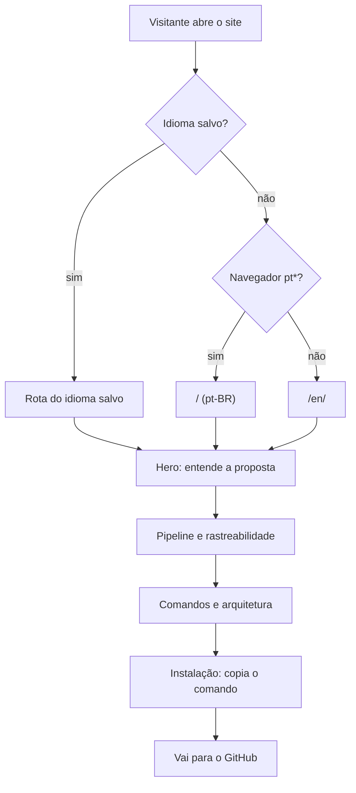
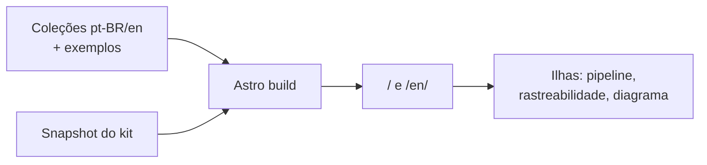

# PRD-001: Landing page do MyAiToolKit

- **Produto/sistema:** site do MyAiToolKit (`MyAiToolKit-Site`)
- **Nível:** Épico
- **Card de origem:** demanda escrita pelo responsável (`PROMPT.md` do projeto de marca)
- **Responsável:** Fabrizio
- **Data:** 2026-10-06
- **Status:** Aprovado
- **Revisão:** 2026-10-07 — RN-16 e CA-27 (crédito ao leanwork-sdd no rodapé); CA-26 ajustado para aceitar esse link

---

## 1. Resumo — obrigatória

Uma página única, em português e inglês, que apresenta o MyAiToolKit: o que ele é, como o pipeline SDD funciona (com duas demandas de exemplo que atravessam as fases), como os documentos se ligam por IDs, quais comandos existem, como o kit é organizado e como instalar. O site é monocromático, rápido, acessível, não rastreia ninguém e foi construído com o próprio kit — os documentos dessa construção ficam públicos no repositório.

## 2. Problema — obrigatória

- **O que dói:** hoje o kit só existe como repositório; para entender o que é SDD e por que usar o kit, é preciso ler um README longo. Quem chega curioso desiste antes de ver o valor.
- **Como é hoje:** README e `REFERENCES.md` no GitHub, sem nenhuma visualização do pipeline ou da rastreabilidade.
- **Se não fizermos:** o projeto continua difícil de apresentar, avaliar e divulgar, e a proposta central ("a IA implementa o que foi decidido") fica abstrata.

## 3. Objetivo — obrigatória

Permitir que qualquer visitante entenda em poucos segundos o que o MyAiToolKit faz, veja o pipeline funcionando com um exemplo concreto e instale o kit na sua IA com o comando certo.

### Como medir o sucesso (opcional)

Sem estatísticas de acesso (proibidas, ver RN-09). O sucesso é verificado por critérios objetivos: todos os `CA` deste PRD com teste verde, Lighthouse ≥ 95 nas quatro categorias no celular e `/sdd-trace` sem elos quebrados.

## 4. Escopo — obrigatória

### 4.1 Entra

- As 12 seções da página (seção 7.1), em pt-BR (`/`) e en (`/en/`).
- Pipeline interativo com seletor entre as duas demandas fictícias e o laço execução ⇄ review.
- Rastreabilidade clicável com mini matriz e um elo quebrado de exemplo.
- Diagrama interativo da arquitetura do kit, com versão estática e versão para celular.
- Referência dos 12 comandos, abas de instalação e botão copiar.
- Troca de idioma e de tema, ambas lembradas.
- Configuração de hospedagem na Netlify, testes automatizados e `README.md` do site.

### 4.2 Não entra

- Estatísticas de acesso, cookies, banner de consentimento, scripts, fontes ou CDNs de terceiros.
- Métricas do GitHub (estrelas, downloads, contribuidores, contadores).
- Documentação completa do kit (o site aponta para o repositório).
- Blog, busca, formulário, login, backend.
- Idiomas além de pt-BR e en.
- Domínio próprio (por enquanto `myaitoolkit.netlify.app`).

## 5. Quem usa — obrigatória quando há interface

| Perfil | Papel | O que faz com o site |
| --- | --- | --- |
| Dev que usa IA para programar | Visitante principal | Entende a proposta, explora o pipeline, copia o comando de instalação |
| Avaliador do projeto | Visitante | Entende o projeto e consulta os documentos SDD da construção |
| Contribuidor em potencial | Visitante | Entende a organização do kit e como contribuir |
| Mantenedor | Responsável | Atualiza conteúdo, sincroniza dados do kit e publica |

## 6. Quebra para o board — obrigatória

- **Épico:** Site do MyAiToolKit
  - **Funcionalidade:** Base visual, marca e layout
    - **História:** tokens, tipografia, grid e componentes base
    - **História:** cabeçalho, rodapé e ícones do navegador
  - **Funcionalidade:** Seções de conteúdo
    - **História:** hero com terminal animado
    - **História:** problema, o que é, por que assim, stacks e IAs, open source
  - **Funcionalidade:** Pipeline e laço
    - **História:** trilha das 6 fases com rolagem conduzida e seletor de demanda
    - **História:** laço execução ⇄ review
  - **Funcionalidade:** Rastreabilidade
    - **História:** cadeia clicável e mini matriz com elo quebrado
  - **Funcionalidade:** Arquitetura do kit
    - **História:** diagrama estático, interativo e animado; acordeão no celular
  - **Funcionalidade:** Comandos e instalação
    - **História:** chips dos 12 comandos com prévia
    - **História:** abas de instalação com botão copiar
  - **Funcionalidade:** Idioma e tema
    - **História:** rotas `/` e `/en/` com detecção e troca manual
    - **História:** tema do sistema com troca manual
  - **Funcionalidade:** Entrega
    - **História:** Netlify, cabeçalhos, privacidade, desempenho e testes

> Proposta, não imposição.
>
> **História não é tarefa.** O `/sdd-plan` quebra cada história em tarefas de 30 min a 4 h.

## 7. Fluxos — obrigatória quando há interação

### 7.1 Estrutura da página

| # | Seção (âncora) | Objetivo | Conteúdo |
| --- | --- | --- | --- |
| 1 | Hero (`#inicio`) | Dizer em 5 s o que é | Título ("Especifique antes. A IA implementa o que foi decidido."), subtítulo com SDD, botões "Instalar" (→ `#instalar`) e "Ver no GitHub", selos "Open source · Claude Code · Codex · MIT", terminal animado com `/sdd-start` e árvore `docs/sdd/` |
| 2 | O problema (`#problema`) | IA sem contexto improvisa | Lado a lado: pedido solto → resultados adivinhados (alternando) × especificação → resultado decidido (fixo) |
| 3 | O que é (`#o-que-e`) | O kit em três ideias | Documentação antes do código; rastreabilidade de ponta a ponta; dev no controle. Nota de projeto de faculdade e open source |
| 4 | Como funciona (`#pipeline`) | As 6 fases | Trilha das fases; cada fase mostra comando, entrada, documento gerado e IDs criados; fase 3 opcional; seletor "Novo projeto" (entra pela fase 1) × "Recuperação de senha" (entra pela fase 2); laço execução ⇄ review fecha a seção |
| 5 | Rastreabilidade (`#rastreabilidade`) | Provar que tudo se liga | Cadeia clicável com os IDs da "Recuperação de senha" e mini matriz no estilo `/sdd-trace` com um elo quebrado |
| 6 | Comandos (`#comandos`) | Referência rápida | 12 chips em Fases, Navegação e Apoio; cada um com quando usar, o que gera e chamada no Codex |
| 7 | Por que assim (`#por-que`) | Benefícios | 8 motivos em Qualidade, Controle e Portabilidade |
| 8 | Arquitetura (`#arquitetura`) | Como o kit é organizado | Diagrama em três colunas e faixa de fluxo |
| 9 | Stacks e IAs (`#stacks`) | Adaptação | Selos das stacks (Rails referência) e `AGENTS.md` no centro ligado a Claude Code, Codex, Cursor e "outras" |
| 10 | Instalação (`#instalar`) | Ação | Abas Claude Code / Codex / Outras IAs; primeiro uso `/sdd-setup` → `/sdd-start` |
| 11 | Open source (`#contribuir`) | Contribuir | Como contribuir, estrutura do repositório, licença MIT e o bloco "Este site foi feito com o MyAiToolKit" |
| 12 | Rodapé | Fechar | Logo, links (GitHub, licença, `docs/sdd` do site), versão do kit, troca de idioma |

### 7.2 Caminho principal



1. O visitante chega e vê a página no idioma certo e no tema certo, sem piscar.
2. O hero diz o que é o kit; o terminal mostra `/sdd-start` virando documentação.
3. O pipeline mostra as fases com uma demanda concreta; a rastreabilidade prova que tudo se liga.
4. O visitante consulta comandos e arquitetura conforme o interesse.
5. Na instalação, escolhe a aba da sua IA e copia o comando.

### 7.3 Desvios

- **Sem JavaScript:** todo o conteúdo aparece em HTML; pipeline como lista, diagrama como SVG com lista equivalente; detecção de idioma não ocorre (fica na rota acessada).
- **Movimento reduzido:** nada se move; terminal, árvore, pipeline e diagrama aparecem completos.
- **Celular:** pipeline em trilha vertical sem rolagem presa; diagrama em acordeão; menu de seções recolhido.
- **Falha ao copiar** (sem permissão de área de transferência): o botão informa a falha e o texto fica selecionado para cópia manual.

## 8. Regras de negócio — obrigatória

- **RN-01:** A logo é sempre o SVG original de `brand/` (preto no tema claro, branco no escuro), nunca redigitada, colorida ou distorcida; 20–24 px de altura no cabeçalho e 48–72 px no hero ou rodapé, com espaço livre de pelo menos metade da altura das maiúsculas. O ícone MA/TK aparece só como ícone do navegador, nunca na página. (ADR-002)
- **RN-02:** O site é monocromático: só os tokens de cor definidos. Estado, ênfase e gravidade são mostrados por inversão, preenchimento (□ → ■), peso, traço (contínuo/tracejado) e rótulo — nunca só por cor. Gravidade do `/code-review`: ■■■ Bloqueante · ■■□ Importante · ■□□ Sugestão. (ADR-002)
- **RN-03:** Nomes de comandos, comandos de instalação, formatos de ID e estrutura de pastas mostrados no site são exatamente os do kit. Cursor, Gemini CLI e GitHub Copilot nunca aparecem como já suportados.
- **RN-04:** A seção de comandos lista os 12 comandos do kit em três grupos — Fases (`/sdd-architect`, `/sdd-prd`, `/sdd-prototype`, `/sdd-plan`, `/sdd-execute`, `/sdd-review`), Navegação (`/sdd-start`, `/sdd-next`, `/sdd-trace`) e Apoio (`/sdd-setup`, `/spike`, `/code-review`) — cada um com quando usar, o que gera e como chamar no Codex (`$nome`). No Claude Code, o do kit aparece como `/my-ai-toolkit:code-review`. A lista é conferida com o snapshot do kit. (ADR-007)
- **RN-05:** As duas demandas fictícias ("Criação de um novo projeto" e "Recuperação de senha") são definidas uma única vez como dados e reutilizadas em todas as seções e nos dois idiomas, com os mesmos IDs nos formatos reais do kit e datas coerentes. "Novo projeto" entra pela fase 1 (opção A); "Recuperação de senha" entra pela fase 2 (opção B). Conteúdo no Anexo A. (ADR-006)
- **RN-06:** pt-BR fica em `/` e en em `/en/`. Sem escolha salva, o primeiro acesso segue o idioma preferido do navegador (`pt*` → pt-BR, qualquer outro → en). A escolha manual (cabeçalho e rodapé) fica lembrada e sempre vence a detecção. Nomes de comandos não se traduzem. A versão en explica que skills e artefatos do kit são em português por padrão e que `project.language: en` gera artefatos em inglês. (ADR-008)
- **RN-07:** O tema segue o sistema; a troca manual fica lembrada e é aplicada sem mostrar o tema errado ao carregar. (ADR-009)
- **RN-08:** Animações explicam algo e rodam uma vez ao entrar na tela; toda animação automática com mais de 5 s tem botões de pausar e repetir; com `prefers-reduced-motion`, nada se move e todo o conteúdo final aparece pronto. (ADR-004)
- **RN-09:** Nenhum script, fonte, imagem ou CDN de terceiros; nenhum cookie; nenhuma estatística de acesso; nenhuma métrica do GitHub. Preferências ficam só no navegador do visitante. (ADR-011, ADR-013)
- **RN-10:** O site atende WCAG 2.2 AA: foco visível de 2 px com 2 px de afastamento, link "Pular para o conteúdo", títulos em ordem, abas no padrão ARIA, diagramas e IDs operáveis por teclado, terminal animado escondido dos leitores de tela que recebem o comando e a saída completos.
- **RN-11:** Metas de desempenho: LCP < 2 s em 4G, menos de 50 KB de JavaScript no carregamento inicial, CLS perto de 0, Lighthouse ≥ 95 nas quatro categorias no celular. (ADR-003, ADR-012)
- **RN-12:** No celular: alvos de toque de pelo menos 44 × 44 px, texto de pelo menos 16 px, margem lateral de 16–20 px, nenhuma rolagem horizontal da página e menu de seções recolhido.
- **RN-13:** A versão do kit exibida é a do `plugin.json` do kit, lida do snapshot sincronizado (hoje `0.1.0`). (ADR-007)
- **RN-14:** A seção Open source traz o bloco "Este site foi feito com o MyAiToolKit", com link para a pasta `docs/sdd/` do repositório do site.
- **RN-15:** O botão copiar copia exatamente o texto do comando mostrado e dá retorno visual ■ → ✓ (e textual, para leitores de tela).
- **RN-16:** O rodapé traz, ao lado do link da licença, o crédito "Pipeline SDD baseado no leanwork-sdd" (en: "SDD pipeline based on leanwork-sdd"), com link para `https://github.com/leanwork/leanwork-sdd`. É o único link externo fora dos repositórios do projeto.

## 9. Critérios de aceite — obrigatória

```gherkin
# language: pt
Funcionalidade: Landing page do MyAiToolKit

  Cenário [CA-01]: Hero apresenta o kit e leva à instalação
    Dado que abro a página inicial
    Quando o hero é exibido
    Então vejo a logo SVG original no tamanho do hero (RN-01)
    E vejo o título, o subtítulo com SDD e os selos "Open source · Claude Code · Codex · MIT"
    E o botão "Instalar" leva à seção de instalação
    E o botão "Ver no GitHub" aponta para o repositório do kit

  Cenário [CA-02]: Terminal do hero mostra um comando virando documentação
    Dado que movimento não está reduzido
    Quando o hero entra na tela
    Então o terminal digita "/sdd-start" e a árvore "docs/sdd/" ganha pastas uma a uma (RN-08)
    E cada arquivo novo entra marcado com "■"
    E um leitor de tela recebe o comando e a saída completos, sem a digitação

  Cenário [CA-03]: Movimento reduzido mostra tudo pronto
    Dado que o navegador pede movimento reduzido
    Quando percorro a página inteira
    Então nenhum elemento se move (RN-08)
    E o terminal, a árvore, o pipeline e o diagrama aparecem completos
    E o pipeline é exibido como lista com todos os documentos visíveis

  Cenário [CA-04]: Navegador em inglês vai para a versão em inglês
    Dado que é meu primeiro acesso e não há idioma salvo
    E o idioma preferido do navegador é "en-US"
    Quando abro "/"
    Então sou levado para "/en/" (RN-06)
    E o documento tem lang "en"

  Cenário [CA-05]: Navegador em português fica na versão em português
    Dado que é meu primeiro acesso e não há idioma salvo
    E o idioma preferido do navegador é "pt-BR"
    Quando abro "/"
    Então continuo em "/" com lang "pt-BR" (RN-06)

  Cenário [CA-06]: Escolha manual de idioma vence a detecção
    Dado que o idioma preferido do navegador é "en-US"
    E escolhi "Português" na troca de idioma
    Quando volto a abrir "/"
    Então continuo em "/" em português (RN-06)

  Cenário [CA-07]: As duas versões se declaram uma à outra
    Dado que abro "/" ou "/en/"
    Então o "<html>" tem o lang da versão
    E há links alternativos "hreflang" para pt-BR, en e x-default com a URL base do site (RN-06)
    E os nomes dos comandos são iguais nas duas versões
    E a versão en explica "project.language: en"

  Cenário [CA-08]: Tema segue o sistema e a escolha manual é lembrada
    Dado que o sistema está em tema escuro e não há tema salvo
    Quando abro o site
    Então vejo o tema escuro com a logo branca (RN-07, RN-01)
    Quando escolho o tema claro e recarrego a página
    Então a página já carrega no tema claro, sem exibir o escuro antes

  Cenário [CA-09]: Pipeline com a demanda de sistema novo
    Dado que estou na seção "Como funciona"
    Quando seleciono "Novo projeto"
    Então a trilha começa pela fase 1 (Arquitetura) (RN-05)
    E cada fase mostra comando, entrada, documento gerado e IDs criados
    E a fase 3 aparece marcada como opcional

  Cenário [CA-10]: Pipeline com a demanda de funcionalidade existente
    Dado que estou na seção "Como funciona"
    Quando seleciono "Recuperação de senha"
    Então a trilha começa pela fase 2 (PRD) e a fase 1 aparece como não usada nesta demanda (RN-05)
    E a fase ativa é exibida como bloco invertido com quadrado preenchido (RN-02)

  Cenário [CA-11]: Laço execução e review
    Dado que chego ao fim da seção "Como funciona"
    Quando o laço é exibido
    Então vejo as tarefas da demanda como quadrados que passam por execução, review e "■"
    E uma tarefa recebe um apontamento R-XX e volta uma vez antes de fechar

  Cenário [CA-12]: Focar um ID destaca a cadeia
    Dado que estou na seção "Rastreabilidade"
    Quando foco um ID da cadeia com o teclado ou com um clique
    Então os IDs ligados a ele ficam destacados e os demais esmaecem
    E o ID focado indica seu estado selecionado para tecnologias assistivas (RN-10)

  Cenário [CA-13]: Elo quebrado aparece com rótulo
    Dado que estou na seção "Rastreabilidade"
    Quando a mini matriz é exibida
    Então o elo quebrado aparece com linha tracejada
    E um rótulo escrito explica a falha, sem depender de cor (RN-02)

  Cenário [CA-14]: Referência dos 12 comandos
    Dado que estou na seção "Comandos"
    Então vejo 12 chips nos grupos Fases, Navegação e Apoio (RN-04)
    E cada chip diz quando usar, o que gera e a chamada no Codex
    E o code-review do kit aparece como "/my-ai-toolkit:code-review" no Claude Code
    E a lista de comandos é igual à do snapshot do kit

  Cenário [CA-15]: Prévia da saída de um comando
    Dado que estou na seção "Comandos"
    Quando passo o mouse ou foco o teclado num chip
    Então vejo uma prévia de 2 a 3 linhas do que o comando entrega

  Cenário [CA-16]: Diagrama da arquitetura interativo
    Dado que estou na seção "Arquitetura"
    Quando ativo um bloco com clique, toque ou teclado
    Então só as ligações desse bloco ficam destacadas
    E um painel mostra explicação, arquivos e comando do bloco
    E o bloco "AGENTS.md" é exibido invertido

  Cenário [CA-17]: Diagrama sem JavaScript
    Dado que o JavaScript está desativado
    Quando abro a seção "Arquitetura"
    Então vejo o diagrama completo em SVG com texto real
    E uma lista equivalente fica disponível para leitores de tela

  Cenário [CA-18]: Ver o fluxo com pausa
    Dado que estou na seção "Arquitetura"
    Quando aciono "Ver o fluxo"
    Então o fluxo de "/sdd-prd" percorre Skills, Templates, Stacks, IA e "docs/sdd/prds/"
    E posso pausar e repetir a animação (RN-08)

  Cenário [CA-19]: Abas de instalação
    Dado que estou na seção "Instalação"
    Quando uso as setas do teclado nas abas
    Então troco entre Claude Code, Codex e Outras IAs seguindo o padrão ARIA de abas (RN-10)
    E os comandos exibidos são exatamente os do kit (RN-03)
    E vejo o primeiro uso "/sdd-setup" seguido de "/sdd-start"

  Cenário [CA-20]: Copiar um comando
    Dado que estou num bloco de comando
    Quando aciono "Copiar"
    Então a área de transferência recebe exatamente o texto exibido (RN-15)
    E o botão passa de "■" para "✓" e anuncia que copiou

  Cenário [CA-21]: Uso no celular
    Dado que abro o site numa tela de 375 px de largura
    Então a página não tem rolagem horizontal (RN-12)
    E os alvos de toque têm pelo menos 44 por 44 px
    E o menu de seções fica recolhido
    E o pipeline é uma trilha vertical sem rolagem presa
    E o diagrama da arquitetura é um acordeão Kit, IAs e Projeto

  Cenário [CA-22]: Acessibilidade sem violações
    Dado que abro "/" e "/en/" nos temas claro e escuro
    Quando a verificação automática de acessibilidade roda
    Então não há violações de WCAG 2.2 A e AA (RN-10)
    E o link "Pular para o conteúdo" é o primeiro item focável

  Cenário [CA-23]: Nada de terceiros nem cookies
    Dado que carrego as duas versões da página e interajo com elas
    Então nenhuma requisição sai para outro domínio (RN-09)
    E nenhum cookie é criado
    E não há números de estrelas, downloads ou contribuidores

  Cenário [CA-24]: Orçamento de desempenho
    Dado que o site foi construído
    Quando o orçamento é verificado
    Então o JavaScript do carregamento inicial soma menos de 50 KB comprimido (RN-11)
    E a página não tem deslocamento de layout perceptível ao carregar

  Cenário [CA-25]: Rodapé, versão e prova de conceito
    Dado que chego ao rodapé
    Então vejo a versão do kit igual à do snapshot sincronizado (RN-13)
    E há links para o GitHub, a licença e a pasta "docs/sdd" do site
    E a seção Open source mostra o bloco "Este site foi feito com o MyAiToolKit" (RN-14)

  Cenário [CA-26]: Links e âncoras íntegros
    Dado que o site foi construído
    Quando os links são verificados
    Então todas as âncoras internas e links do site existem
    E os links do GitHub apontam para "github.com/fbzsaullo/MyAiToolKit", exceto o crédito do rodapé, que aponta para "github.com/leanwork/leanwork-sdd" (RN-16)

  Cenário [CA-27]: Crédito ao pipeline de origem no rodapé
    Dado que chego ao rodapé
    Então vejo, ao lado do link da licença, "Pipeline SDD baseado no leanwork-sdd" (en: "SDD pipeline based on leanwork-sdd")
    E o link leva a "https://github.com/leanwork/leanwork-sdd" (RN-16)
```

## 10. Permissões

Não se aplica: site público, sem login.

## 11. Dados e integrações — obrigatória quando se aplica

### 11.1 Sistemas envolvidos
- **Repositório do kit** — fonte dos nomes dos comandos e da versão, lida no momento da sincronização (ADR-007).
- **Netlify** — build e hospedagem (ADR-011).
- **GitHub** — apenas links de navegação, sem API.

### 11.2 O que é lido
- `skills/*/SKILL.md` (frontmatter) e `.claude-plugin/plugin.json` do kit, pelo script de sincronização.

### 11.3 O que é gravado
- No repositório: `src/data/kit.json` (snapshot).
- No navegador do visitante: `localStorage` com `matk-lang` e `matk-theme`. Nenhum dado sai do navegador.

## 12. Estados da entidade

Não se aplica.

## 13. Encaixe técnico (opcional)



Detalhes na proposta de arquitetura e nos ADR-001 a ADR-012.

## 14. Restrições e premissas (opcional)

- **Restrição:** arquivos de `brand/` não são alterados (copiados para `public/` no build).
- **Restrição:** fontes Geist e Geist Mono hospedadas no site (ADR-013).
- **Premissa:** URL base provisória `https://myaitoolkit.netlify.app`, definida pelo responsável.
- **Premissa:** os textos curtos dos chips de comando são escritos nas coleções de conteúdo e conferidos contra as descrições dos `SKILL.md`; o snapshot garante a lista e a versão (ADR-007).

## 15. Riscos e dependências — obrigatória

| Tipo | Descrição | Resposta / plano B |
| --- | --- | --- |
| Risco | Rolagem conduzida estourar orçamento de JS ou CLS | Ilha sob demanda e medição no build; plano B: pipeline só com destaque por `IntersectionObserver`, sem `sticky` |
| Risco | Diagrama ilegível no celular | Acordeão próprio para celular |
| Risco | Traduções divergirem | Teste de chaves pt-BR × en |
| Dependência | Conta na Netlify para publicar | Site pronto para conectar; publicação fica com o responsável |

## 16. Pontos em aberto (opcional)

- [ ] Domínio definitivo (hoje `myaitoolkit.netlify.app`) — responsável: Fabrizio

## 17. Referências (opcional)

- Demanda: `PROMPT.md` do projeto de marca.
- Proposta: `docs/sdd/architecture/proposta-arquitetural.md`.
- ADRs: `docs/sdd/architecture/adrs/ADR-001` a `ADR-014`.
- Kit: https://github.com/fbzsaullo/MyAiToolKit — `README.md` e `templates/id-conventions.md`.
- Pipeline de origem: https://github.com/leanwork/leanwork-sdd (crédito no rodapé, RN-16).

---

## Anexo A — As duas demandas fictícias

Conteúdo **exibido no site** como exemplo. Os IDs abaixo pertencem às demandas fictícias, não a este PRD, e por isso estão num bloco de dados: não entram na rastreabilidade do site. A estrutura vira dado em `src/content/examples/` (RN-05).

```yaml
# Demanda A — "Criação de um novo projeto" (sdd-start opção A, entra pela fase 1)
sistema: Inscrições em eventos acadêmicos
arquitetura:
  - ADR-001: Monolito modular em Rails
  - ADR-002: E-mails de confirmação em fila (Solid Queue)
prd: PRD-001-inscricoes-em-eventos (2026-09-01)
regras:
  - RN-01: Cada evento tem limite de vagas
  - RN-02: A inscrição é confirmada por e-mail (ADR-002)
cenarios:
  - CA-01: Inscrição em evento com vaga
  - CA-02: Evento lotado recusa a inscrição
telas: [UI-01 lista de eventos (.vazio), UI-02 inscrição (.lotado)]
plano: PLAN-001 com T-01 model de inscrição, T-02 serviço de inscrição, T-03 tela de inscrição
review: REVIEW-T-02-2026-09-10 — aprovado com ressalvas, R-01 (Importante) índice ausente

# Demanda B — "Recuperação de senha" (sdd-start opção B, entra pela fase 2)
sistema: sistema existente (sem arquitetura nova)
prd: PRD-007-recuperacao-de-senha (2026-09-14)
regras:
  - RN-01: O link de recuperação usa um token de uso único
  - RN-02: O token expira em 30 minutos
  - RN-03: A resposta é a mesma para e-mail cadastrado ou não
  - RN-04: Definir a nova senha encerra as sessões ativas
cenarios:
  - CA-01: Pedido com e-mail cadastrado envia o link (UI-01.enviado)
  - CA-02: Pedido com e-mail não cadastrado mostra a mesma mensagem (RN-03)
  - CA-03: Link expirado é recusado (UI-02.expirado)
  - CA-04: Link já usado é recusado (UI-02.usado)
  - CA-05: Nova senha encerra as outras sessões (RN-04)
telas:
  - UI-01 pedido de recuperação: .default, .enviado
  - UI-02 nova senha: .default, .expirado, .usado, .sucesso
plano: PLAN-007
tarefas:
  - T-01: Tabela de tokens de recuperação
  - T-02: Gerar token e enviar e-mail (RN-01, RN-03; CA-01, CA-02)
  - T-03: Validar token e trocar a senha (RN-01, RN-02; CA-03, CA-04)
  - T-04: Telas de pedido e de nova senha (UI-01, UI-02)
  - T-05: Encerrar sessões ao trocar a senha (RN-04; CA-05)
review:
  - REVIEW-T-03-2026-09-18 — Bloqueado: R-01 (Bloqueante, segurança) token comparado com == e gravado sem hash
  - REVIEW-T-03-2026-09-19-round2 — Aprovado: R-01 (round 1) resolvido
teste_exemplo: 'it "CA-03: link expira após 30 minutos"'
elo_quebrado_exemplo: "RN-04 sem teste" — CA-05 não tem teste com o ID no nome
```
