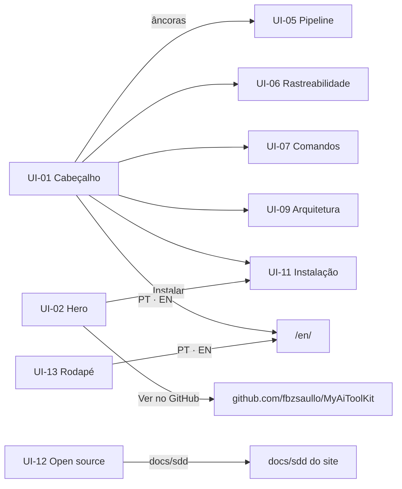

# SPEC-UI-001: Landing page do MyAiToolKit

- **PRD:** `docs/sdd/prds/PRD-001-landing-page.md`
- **Arquitetura:** `docs/sdd/architecture/proposta-arquitetural.md`
- **Modo:** Geração
- **Protótipo:** não há protótipo visual separado — a identidade visual está especificada por escrito (tokens, tipografia, estilo e componentes na demanda) e a implementação é a primeira materialização; esta SPEC-UI define estrutura, estados e vínculos
- **Fidelidade:** Alta (definida pela identidade visual)
- **Responsável:** Fabrizio
- **Data:** 2026-10-06
- **Status:** Aprovado

---

## 1. Contexto

- **Tipo de interface:** site institucional de produto técnico, com seções explicativas interativas
- **Dispositivo principal:** responsivo completo (desktop e celular com igual peso)
- **Tecnologia de frontend:** Astro 7 estático, CSS próprio com tokens, ilhas Preact (`client:visible`) e Motion (ADR-001 a ADR-004)

**De onde veio cada informação**

| Fonte | Contribuição |
| --- | --- |
| Demanda (identidade visual) | Tokens, tipografia, estilo "folha de especificação", lista de componentes, animações |
| PRD-001 | Seções, regras RN-01…RN-15, cenários CA-01…CA-26, demandas de exemplo |
| Arquitetura | Ilhas, camada estática obrigatória, idioma e tema sem piscar |
| Derivado nesta fase | Estados de movimento reduzido, sem JavaScript, celular, erro de cópia, menu aberto |

**Convenção de estados globais** — valem para toda tela com animação ou interação:

| Sufixo | Significa |
| --- | --- |
| `.default` | Desktop, movimento permitido, JavaScript ativo |
| `.reduzido` | `prefers-reduced-motion: reduce`: conteúdo final pronto, nada se move |
| `.semJs` | JavaScript desativado: só a camada estática |
| `.celular` | Largura ≤ 767 px |

---

## 2. Tokens visuais

Definidos pela identidade e implementados em `src/styles/tokens.css` — valores não repetidos aqui. Resumo das regras que afetam estados:

- **Ativo / selecionado:** bloco invertido (`ink` de fundo, `bg` no texto) + quadrado preenchido ■.
- **Inativo / esmaecido:** `text-muted` e conectores em `line-strong`.
- **Elo quebrado:** traço tracejado + rótulo escrito.
- **Gravidade:** ■■■ Bloqueante · ■■□ Importante · ■□□ Sugestão.
- **Foco:** contorno de 2 px em `ink` com 2 px de afastamento.
- **Movimento:** `--dur-fast` 150–200 ms, `--dur-explain` 400–700 ms, `--ease` `cubic-bezier(0.2, 0, 0, 1)`.

---

## 3. Lista de telas

| ID | Tela (seção) | Âncora | Perfil | Regras (RN) | Cenários (CA) |
| --- | --- | --- | --- | --- | --- |
| UI-01 | Cabeçalho | — | Todos | RN-01, RN-06, RN-07, RN-12 | CA-06, CA-08, CA-21 |
| UI-02 | Hero | `#inicio` | Todos | RN-01, RN-08 | CA-01, CA-02, CA-03 |
| UI-03 | O problema | `#problema` | Todos | RN-08 | CA-03 |
| UI-04 | O que é | `#o-que-e` | Todos | — | — |
| UI-05 | Como funciona (pipeline e laço) | `#pipeline` | Todos | RN-02, RN-05, RN-08, RN-12 | CA-03, CA-09, CA-10, CA-11, CA-21 |
| UI-06 | Rastreabilidade | `#rastreabilidade` | Todos | RN-02, RN-05, RN-10 | CA-12, CA-13 |
| UI-07 | Comandos | `#comandos` | Todos | RN-03, ~~RN-04~~ RN-17 (PRD-002) | ~~CA-14~~ CA-28 (PRD-002), CA-15 |
| UI-08 | Por que assim | `#por-que` | Todos | — | — |
| UI-09 | Arquitetura do kit | `#arquitetura` | Todos | RN-08, RN-10, RN-12 | CA-03, CA-16, CA-17, CA-18, CA-21 |
| UI-10 | Stacks e IAs | `#stacks` | Todos | RN-03, RN-08 | CA-03 |
| UI-11 | Instalação | `#instalar` | Todos | RN-03, RN-10, RN-15 | CA-19, CA-20 |
| UI-12 | Open source | `#contribuir` | Todos | RN-14 | CA-25 |
| UI-13 | Rodapé | — | Todos | RN-01, RN-06, RN-13, RN-16 | CA-06, CA-25, CA-27 |

Estados de página inteira (não são telas): idioma (`/` e `/en/`, CA-04, CA-05, CA-07), tema (CA-08), acessibilidade (CA-22), privacidade (CA-23), desempenho (CA-24) e links (CA-26).

---

## 4. Cada tela

### UI-01 — Cabeçalho

- **Para que serve:** orientar e dar acesso rápido às seções, ao GitHub, ao tema e ao idioma.
- **Conteúdo:** logo SVG (20–24 px, RN-01), âncoras (Como funciona, Rastreabilidade, Comandos, Arquitetura, Instalar), link "GitHub" sem contagem, botão de tema, troca de idioma `PT · EN`, link "Pular para o conteúdo" antes de tudo.
- **Fixo** no topo, com borda inferior de 1 px.

| Estado | ID | Quando acontece | O que aparece | Origem |
| --- | --- | --- | --- | --- |
| Padrão | `UI-01.default` | Desktop | Logo + âncoras + ações em uma linha | Demanda |
| Menu fechado | `UI-01.celular` | ≤ 767 px | Logo + botão "Seções" (44×44) + tema + idioma | Derivado do RN-12 |
| Menu aberto | `UI-01.menuAberto` | Botão "Seções" acionado | Lista das âncoras em painel; foco preso no painel; Esc fecha | Derivado do RN-12 |
| Seção ativa | `UI-01.secaoAtiva` | Rolagem passa por uma seção | Âncora correspondente com quadrado ■ e `aria-current` | Derivado |
| Sem JS | `UI-01.semJs` | JS desativado | Menu do celular vira `
` nativo; trocas de tema e idioma são links | Derivado da arquitetura |

**Para onde se vai daqui:** âncoras da página; GitHub do kit; `/en/` ↔ `/`.

### UI-02 — Hero

- **Conteúdo:** logo 48–72 px; display "Especifique antes. A IA implementa o que foi decidido."; subtítulo explicando SDD; botões "Instalar" (principal, `ink`) e "Ver no GitHub" (secundário, borda); selos "Open source · Claude Code · Codex · MIT"; à direita (abaixo no celular) a janela de terminal com a árvore `docs/sdd/`.

| Estado | ID | Quando acontece | O que aparece | Origem |
| --- | --- | --- | --- | --- |
| Digitando | `UI-02.digitando` | Hero entra na tela (uma vez) | Terminal digita `/sdd-start` em `steps()`; cursor em bloco | Demanda (CA-02) |
| Árvore crescendo | `UI-02.arvore` | Após o comando | Pastas de `docs/sdd/` entram uma a uma; arquivo novo marcado ■ | Demanda (CA-02) |
| Completo | `UI-02.completo` | Fim da animação | Terminal e árvore finais; botões "Repetir" | Derivado do RN-08 |
| Pausado | `UI-02.pausado` | "Pausar" acionado (animação > 5 s) | Quadro atual congelado; "Continuar" | Derivado do RN-08 |
| Reduzido | `UI-02.reduzido` | Movimento reduzido | Diretamente `.completo`, sem botões de animação | Derivado do CA-03 |

**Acessibilidade:** a área animada tem `aria-hidden="true"`; um bloco com classe visualmente oculta traz o comando e a saída completos (CA-02).

### UI-03 — O problema

- **Conteúdo:** duas colunas. Esquerda "Pedido solto": o mesmo pedido de texto livre e três resultados diferentes que se alternam (rótulo "resultado adivinhado"). Direita "Especificação": o mesmo pedido com `RN` e `CA`, e um resultado fixo (rótulo "resultado decidido").

| Estado | ID | Quando acontece | O que aparece | Origem |
| --- | --- | --- | --- | --- |
| Alternando | `UI-03.default` | Seção visível | Esquerda troca entre 3 resultados (≤ 5 s no total, uma volta) | Demanda |
| Reduzido / sem JS | `UI-03.reduzido` | Movimento reduzido ou sem JS | Os 3 resultados empilhados, numerados, à esquerda | Derivado do CA-03 |
| Celular | `UI-03.celular` | ≤ 767 px | Colunas empilhadas: solto em cima, especificação embaixo | Derivado do RN-12 |

### UI-04 — O que é

- **Conteúdo:** três cartões numerados (`01`, `02`, `03`): Documentação antes do código; Rastreabilidade de ponta a ponta; Dev no controle. Aviso (callout) "Projeto de faculdade, open source, licença MIT" e nota de que skills e artefatos são em português por padrão (`project.language: en` para inglês — destaque na versão en).
- **Estados:** apenas `UI-04.default` e `UI-04.celular` (cartões empilhados).

### UI-05 — Como funciona (pipeline e laço)

- **Conteúdo:** seletor (abas) "Novo projeto" × "Recuperação de senha"; trilha das 6 fases com ícones próprios; para a fase ativa: rótulo `FASE 0N`, comando (chip), entrada, documento gerado (trecho que "se escreve"), IDs criados (etiquetas) ligados ao ID-pai; fase 3 com rótulo "opcional"; ao final, o laço execução ⇄ review.

| Estado | ID | Quando acontece | O que aparece | Origem |
| --- | --- | --- | --- | --- |
| Novo projeto | `UI-05.novoProjeto` | Seletor em "Novo projeto" (padrão) | Trilha começa na fase 1 | CA-09 |
| Recuperação | `UI-05.recuperacao` | Seletor em "Recuperação de senha" | Fase 1 com traço tracejado e rótulo "não usada nesta demanda"; trilha começa na 2 | CA-10 |
| Fase ativa | `UI-05.faseAtiva` | Rolagem chega a uma fase | Nó invertido com ■; documento se escreve linha a linha; IDs surgem e se ligam ao pai | CA-10 |
| Fase opcional | `UI-05.opcional` | Fase 3 | Rótulo "opcional — só com telas"; borda tracejada | CA-09 |
| Laço | `UI-05.laco` | Fim da seção | Barra T-01…T-0N em □; cada uma passa por execução → review → ■; uma recebe R-01 e volta uma vez | CA-11 |
| Laço pausado | `UI-05.lacoPausado` | "Pausar" (animação > 5 s) | Quadro congelado; "Continuar" e "Repetir" | Derivado do RN-08 |
| Reduzido | `UI-05.reduzido` | Movimento reduzido | Lista das 6 fases com todos os documentos e IDs visíveis; laço com estado final | CA-03 |
| Sem JS | `UI-05.semJs` | JS desativado | Mesmo que `.reduzido`; seletor vira dois blocos sequenciais | Derivado da arquitetura |
| Celular | `UI-05.celular` | ≤ 767 px | Trilha vertical à esquerda; cada fase acende ao chegar ao centro da tela; sem rolagem presa | CA-21 |

**Rolagem conduzida (desktop):** a trilha fica `sticky`; cada fase ocupa um trecho de rolagem; nada impede rolar normalmente nem pular para outra seção.

### UI-06 — Rastreabilidade

- **Conteúdo:** cadeia horizontal (vertical no celular) com os IDs da "Recuperação de senha": `RN-02` → `CA-03` → `UI-02.expirado` → `T-03` → `R-01 (REVIEW-T-03-2026-09-18)` → `it "CA-03: link expira após 30 minutos"`; abaixo, mini matriz no estilo `/sdd-trace` com `RN-01…RN-04`, incluindo o elo quebrado "RN-04 sem teste".

| Estado | ID | Quando acontece | O que aparece | Origem |
| --- | --- | --- | --- | --- |
| Padrão | `UI-06.default` | Nada focado | Cadeia completa, conectores em `line-strong` | Demanda |
| Foco | `UI-06.foco` | ID focado (Tab, clique ou toque) | ID invertido; IDs da mesma cadeia em `text`, conectores em `ink`; demais esmaecidos; `aria-pressed="true"` | CA-12 |
| Elo quebrado | `UI-06.eloQuebrado` | Sempre visível na matriz | Linha tracejada até "—" e rótulo "RN-04 sem teste" | CA-13 |
| Sem JS | `UI-06.semJs` | JS desativado | Cadeia e matriz completas, sem destaque interativo | Derivado |
| Celular | `UI-06.celular` | ≤ 767 px | Cadeia vertical; matriz com rolagem horizontal só dentro dela | RN-12 |

### UI-07 — Comandos

- **Conteúdo:** ~~12 chips (ver RN-04) em três grupos~~ um chip por comando do kit em quatro grupos — Fases, Navegação, Mudança e Apoio (RN-17 do PRD-002) — com títulos; cada chip: nome (Geist Mono), "quando usar", "o que gera", "Codex: `$nome`"; prévia de 2–3 linhas da saída.

| Estado | ID | Quando acontece | O que aparece | Origem |
| --- | --- | --- | --- | --- |
| Padrão | `UI-07.default` | — | Grade de chips em quatro grupos | CA-28 (PRD-002) |
| Prévia | `UI-07.previa` | Hover ou foco no chip | Painel abaixo do chip com a prévia (transição 150–200 ms) | CA-15 |
| Celular / toque | `UI-07.celular` | ≤ 767 px | Chips em lista; prévia sempre visível (sem hover) | Derivado do RN-12 |

### UI-08 — Por que assim

- **Conteúdo:** 8 motivos em três grupos (Qualidade, Controle, Portabilidade), cada um com marcador ■ e texto curto.
- **Estados:** `UI-08.default`, `UI-08.celular` (grupos empilhados).

### UI-09 — Arquitetura do kit

- **Conteúdo:** diagrama em três colunas — Kit `my-ai-toolkit` (Skills, Templates, Stacks, Adapters), IAs de programação (Claude Code principal, Codex suportado, Outras), Projeto do usuário (`AGENTS.md` invertido, `CLAUDE.md`, `docs/sdd/config.yml`, `docs/sdd/` com pastas) — e faixa embaixo com o fluxo das fases e o laço. Conectores rotulados: usam, instalam, leem, geram. Painel de detalhes ao lado (abaixo no celular).

| Estado | ID | Quando acontece | O que aparece | Origem |
| --- | --- | --- | --- | --- |
| Estático | `UI-09.default` | Antes de qualquer interação | Diagrama completo, sem destaque | CA-17 |
| Selecionado | `UI-09.selecionado` | Bloco ativado (clique, toque, Enter/Espaço) | Bloco invertido, só suas ligações em `ink`; painel com explicação, arquivos e comando | CA-16 |
| Fluxo | `UI-09.fluxo` | "Ver o fluxo" acionado | ~6 s: `/sdd-prd` acende em Skills → Templates → Stacks → IA → `docs/sdd/prds/` | CA-18 |
| Fluxo pausado | `UI-09.pausado` | "Pausar" durante o fluxo | Quadro congelado; "Continuar" e "Repetir" | CA-18 |
| Reduzido | `UI-09.reduzido` | Movimento reduzido | Seleção funciona sem transição; "Ver o fluxo" mostra os passos numerados de uma vez | CA-03 |
| Sem JS | `UI-09.semJs` | JS desativado | SVG completo com texto real + lista equivalente | CA-17 |
| Celular | `UI-09.celular` | ≤ 767 px | Acordeão Kit → IAs → Projeto; fases em lista vertical | CA-21 |

### UI-10 — Stacks e IAs

- **Conteúdo:** selos de texto das stacks (Rails "referência", Node.js/TypeScript, Python, .NET, Go, Java/Kotlin, PHP, "genérico"); diagrama com `AGENTS.md` ao centro (invertido) ligado a Claude Code, Codex, Cursor e "outras". Cursor e "outras" com rótulo "lê AGENTS.md" — nunca "suportado" (RN-03).

| Estado | ID | Quando acontece | O que aparece | Origem |
| --- | --- | --- | --- | --- |
| Acendendo | `UI-10.default` | Seção entra na tela | Linhas acendem em sequência do `AGENTS.md` para cada IA | Demanda |
| Reduzido / sem JS | `UI-10.reduzido` | Movimento reduzido ou sem JS | Todas as linhas já acesas | CA-03 |
| Celular | `UI-10.celular` | ≤ 767 px | `AGENTS.md` em cima, IAs em lista abaixo | RN-12 |

### UI-11 — Instalação

- **Conteúdo:** abas "Claude Code · Codex · Outras IAs" (padrão ARIA), cada uma com bloco de código e botão copiar; depois "Primeiro uso": `/sdd-setup` → `/sdd-start`.

| Estado | ID | Quando acontece | O que aparece | Origem |
| --- | --- | --- | --- | --- |
| Claude Code | `UI-11.claude` | Aba padrão | 3 comandos de instalação + atualizar + `/plugin` | CA-19 |
| Codex | `UI-11.codex` | Aba Codex | `install.sh` e `install.ps1`; nota sobre `--scope repo` | CA-19 |
| Outras IAs | `UI-11.outras` | Aba Outras | Explicação do adaptador e `adapters/README.md`; Cursor, Gemini CLI e Copilot citados como próximos | CA-19 |
| Copiado | `UI-11.copiado` | Copiar com sucesso | Botão ■ → ✓ por 2 s; anúncio "Copiado" (`aria-live`) | CA-20 |
| Erro ao copiar | `UI-11.erroCopia` | Área de transferência indisponível | Texto selecionado; mensagem "Selecionado — use Ctrl+C" | Derivado do PRD 7.3 |
| Sem JS | `UI-11.semJs` | JS desativado | Os três painéis em sequência, com títulos; sem botão copiar | Derivado |

### UI-12 — Open source

- **Conteúdo:** como contribuir (`CONTRIBUTING.md`, issues, perfis de stack, adaptadores, `scripts/check.sh` no CI); árvore curta do repositório do kit; licença MIT; bloco invertido "Este site foi feito com o MyAiToolKit" com link para `docs/sdd/` do repositório do site.
- **Estados:** `UI-12.default`, `UI-12.celular`.

### UI-13 — Rodapé

- **Conteúdo:** logo 48–72 px; links GitHub, Licença, "Pipeline SDD baseado no leanwork-sdd" (logo após a licença; RN-16), `docs/sdd` do site; "MyAiToolKit 0.1.0" (do snapshot); troca de idioma.
- **Estados:** `UI-13.default`, `UI-13.celular` (colunas empilhadas).

---

## 5. Componentes repetidos

| Componente | Telas | O que é | Estados |
| --- | --- | --- | --- |
| `Logo` | UI-01, UI-02, UI-13 | Wordmark SVG preto/branco conforme o tema | claro, escuro |
| `CommandChip` | UI-05, UI-07, UI-11 | Comando em Geist Mono com borda | default, foco, sublinhado (`/sdd-*`) |
| `IdTag` | UI-05, UI-06 | Etiqueta de ID (`RN-03`) | default, ativo (invertido), esmaecido, quebrado |
| `PhaseIcon` | UI-05, UI-09 | 6 ícones próprios no grid de 24 px | default, ativo |
| `CodeBlock` | UI-02, UI-11, UI-12 | Bloco com cabeçalho, copiar e linha destacada | default, copiado, erroCopia |
| `Terminal` | UI-02, UI-05 | Janela escura com cursor em bloco | digitando, completo, pausado |
| `FileTree` | UI-02, UI-12 | Árvore de pastas com marcador ■ | crescendo, completo |
| `Tabs` | UI-05, UI-11 | Abas no padrão ARIA | ativa, inativa, foco |
| `Callout` | UI-04, UI-12 | Aviso com ícone | default |
| `StackBadge` | UI-10 | Selo de stack em texto | default, referência |
| `MotionControls` | UI-02, UI-05, UI-09 | Botões pausar/continuar/repetir | rodando, pausado, terminado |
| `Section` | todas | Seção numerada (`01 — …`) com grid aparente opcional | default |

---

## 6. Navegação

---

## 7. Cobertura do PRD

### Regras

| RN | Aparece em | Situação |
| --- | --- | --- |
| RN-01 | UI-01, UI-02, UI-13 (`Logo`) | ✅ |
| RN-02 | UI-05, UI-06 (`IdTag`), estados ativos | ✅ |
| RN-03 | UI-07, UI-10, UI-11 | ✅ |
| ~~RN-04~~ | UI-07 — substituída pela RN-17 do PRD-002 | — |
| RN-05 | UI-05, UI-06 | ✅ |
| RN-06 | UI-01, UI-13; rotas | ✅ |
| RN-07 | UI-01; página inteira | ✅ |
| RN-08 | UI-02, UI-03, UI-05, UI-09, UI-10 (`.reduzido`, `MotionControls`) | ✅ |
| RN-09 | Página inteira (sem elementos visuais) | ⚠️ Regra de entrega — verificada por teste, sem tela |
| RN-10 | UI-01, UI-06, UI-09, UI-11 | ✅ |
| RN-11 | Página inteira | ⚠️ Regra de entrega — verificada por orçamento, sem tela |
| RN-12 | Estados `.celular` de todas as telas | ✅ |
| RN-13 | UI-13 | ✅ |
| RN-14 | UI-12 | ✅ |
| RN-15 | UI-11 (`CodeBlock`) | ✅ |
| RN-16 | UI-13 | ✅ |

### Cenários

| CA | Acontece em | Situação |
| --- | --- | --- |
| CA-01 | UI-02 | ✅ |
| CA-02 | UI-02 (`.digitando`, `.arvore`) | ✅ |
| CA-03 | `.reduzido` de UI-02, UI-03, UI-05, UI-09, UI-10 | ✅ |
| CA-04, CA-05, CA-07 | Rotas `/` e `/en/` | ✅ (página inteira) |
| CA-06 | UI-01, UI-13 | ✅ |
| CA-08 | UI-01; página inteira | ✅ |
| CA-09 | UI-05.novoProjeto, UI-05.opcional | ✅ |
| CA-10 | UI-05.recuperacao, UI-05.faseAtiva | ✅ |
| CA-11 | UI-05.laco | ✅ |
| CA-12 | UI-06.foco | ✅ |
| CA-13 | UI-06.eloQuebrado | ✅ |
| ~~CA-14~~ | UI-07 — substituído pelo CA-28 do PRD-002 | — |
| CA-15 | UI-07.previa | ✅ |
| CA-16 | UI-09.selecionado | ✅ |
| CA-17 | UI-09.semJs | ✅ |
| CA-18 | UI-09.fluxo, UI-09.pausado | ✅ |
| CA-19 | UI-11.claude, .codex, .outras | ✅ |
| CA-20 | UI-11.copiado | ✅ |
| CA-21 | `.celular` de UI-01, UI-05, UI-09 | ✅ |
| CA-22 | Página inteira | ✅ (verificação automática) |
| CA-23 | Página inteira | ✅ (verificação automática) |
| CA-24 | Página inteira | ✅ (orçamento) |
| CA-25 | UI-12, UI-13 | ✅ |
| CA-26 | Página inteira | ✅ (checagem de links) |
| CA-27 | UI-13 | ✅ |

---

## 8. Lacunas

| # | Lacuna | Efeito | Decisão |
| --- | --- | --- | --- |
| 1 | Não há protótipo visual aprovado antes do código | Ajustes visuais acontecem na implementação | Aceito pelo responsável (autonomia concedida em 2026-10-06); a identidade escrita é a referência |
| 2 | Estados `.semJs`, `.erroCopia`, `.menuAberto` derivados nesta fase | Não vieram da demanda | Aceitos como necessários para RN-10 e RN-12 |
| 3 | UI-04 e UI-08 não têm cenário próprio | Conteúdo estático, coberto por CA-22 e CA-26 | Aceito — não há comportamento a provar |

---

## 9. Restrições de interface

- Contraste conforme a paleta (WCAG AA); informação nunca só por cor.
- Cantos 0 px em blocos, até 4 px em botões e etiquetas; bordas de 1 px; nenhuma sombra, gradiente ou brilho.
- Ícones Lucide com `stroke-linecap="square"` e `stroke-linejoin="miter"`, 1,75 px a 24 px, desenhados como SVG inline; seis ícones próprios das fases.
- Linhas de até ~68 caracteres; `tabular-nums` em tabelas e contadores.
- Alvos de toque ≥ 44 × 44 px; texto ≥ 16 px no celular; margem lateral 16–20 px; nenhuma rolagem horizontal da página.

## 10. Revisões

| Nº | Data | O que mudou | IDs | Motivo / origem |
| --- | --- | --- | --- | --- |
| 1 | 2026-10-07 | UI-13 ganha o crédito ao leanwork-sdd | ~UI-13 | Revisão 1 do PRD-001 |
| 2 | 2026-10-07 | UI-07 mostra os comandos do kit 0.3.1, em quatro grupos | ~UI-07 | PRD-002 (RN-17, CA-28) |
