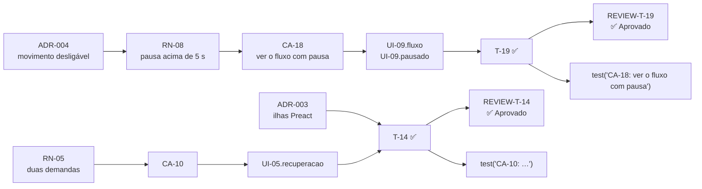

# Matriz de rastreabilidade — PRD-001 Landing page

- **PRD:** [`PRD-001-landing-page.md`](../prds/PRD-001-landing-page.md)
- **Plano:** [`PLAN-001-landing-page.md`](../plans/PLAN-001-landing-page.md)
- **SPEC-UI:** [`SPEC-UI-001-landing-page.md`](../prototype/SPEC-UI-001-landing-page.md)
- **ADRs:** [`architecture/adrs/`](../architecture/adrs/) — 13 arquivos (12 Aceito, ADR-010 Substituído por ADR-013)
- **Reviews:** [`reviews/`](../reviews/) — 24 arquivos, um por tarefa
- **Testes:** `tests/*.spec.ts`, nome no formato `test("CA-XX: …")`
- **Gerada por:** skill `sdd-trace` do MyAiToolKit, em 2026-10-07, depois da T-24 (commit `0956390`)

> A matriz é uma fotografia. Quando PRD, SPEC-UI ou plano mudarem, gere de novo.

## Resultado

**Nenhum elo quebrado.**

| Conjunto | Total | Ligado |
| --- | --- | --- |
| Regras (RN) | 15 | 15 com cenário e com tarefa |
| Cenários (CA) | 26 | 26 com tarefa e 26 com teste |
| Telas (UI) | 13 | 13 com tarefa |
| Estados de tela | 54 | 54 declarados em alguma tarefa |
| Tarefas (T) | 24 | 24 `Concluído`, 24 com review |
| Apontamentos (R) | 12 | 0 em aberto, 0 Bloqueante |
| ADRs citados | 12 | 12 existem e estão `Aceito` |

### Tabela 1 — Da regra ao review

| RN | Regra (resumo) | Provada por (CA) | Feita em (T) | Decisão (ADR) | Review |
| --- | --- | --- | --- | --- | --- |
| RN-01 | Logo SVG original; ícone MA/TK só no navegador | CA-01, CA-08 | T-08, T-10, T-11 | ADR-002 | T-08 ⚠️ · T-10 ⚠️ · T-11 ✅ |
| RN-02 | Monocromático; estado nunca só por cor | CA-10, CA-13 | T-04, T-08, T-14, T-16 | ADR-002 | T-04 ⚠️ · T-08 ⚠️ · T-14 ✅ · T-16 ✅ |
| RN-03 | Comandos, IDs e pastas exatos do kit | CA-19 | T-17, T-20, T-21 | — | T-17 ✅ · T-20 ✅ · T-21 ✅ |
| RN-04 | 12 comandos em três grupos | CA-14 | T-17 | ADR-007 | T-17 ✅ |
| RN-05 | Duas demandas de exemplo, IDs escritos uma vez | CA-09, CA-10 | T-06, T-13, T-14, T-16 | ADR-006 | T-06 ✅ · T-13 ⚠️ · T-14 ✅ · T-16 ✅ |
| RN-06 | pt-BR em `/`, en em `/en/`, escolha lembrada | CA-04, CA-05, CA-06, CA-07 | T-05, T-10 | ADR-008 | T-05 ⚠️ · T-10 ⚠️ |
| RN-07 | Tema do sistema, troca lembrada sem piscar | CA-08 | T-05, T-10 | ADR-009 | T-05 ⚠️ · T-10 ⚠️ |
| RN-08 | Movimento desligável; pausa acima de 5 s | CA-02, CA-03, CA-18 | T-11, T-12, T-14, T-15, T-19, T-23 | ADR-004 | T-11 ✅ · T-12 ✅ · T-14 ✅ · T-15 ⚠️ · T-19 ✅ · T-23 ✅ |
| RN-09 | Nenhum terceiro, cookie ou estatística | CA-23 | T-22, T-23 | ADR-011, ADR-013 | T-22 ✅ · T-23 ✅ |
| RN-10 | WCAG 2.2 AA | CA-12, CA-19, CA-22 | T-16, T-18, T-19, T-21, T-23 | — | T-16 ✅ · T-18 ⚠️ · T-19 ✅ · T-21 ✅ · T-23 ✅ |
| RN-11 | LCP < 2 s, JS < 50 KB, CLS perto de 0 | CA-24 | T-23 | ADR-003, ADR-012 | T-23 ✅ |
| RN-12 | Celular sem rolagem lateral nem rolagem presa | CA-21 | T-10, T-14, T-18, T-23 | — | T-10 ⚠️ · T-14 ✅ · T-18 ⚠️ · T-23 ✅ |
| RN-13 | Versão do kit lida do snapshot | CA-25 | T-07, T-10 | ADR-007 | T-07 ✅ · T-10 ⚠️ |
| RN-14 | Bloco "feito com o MyAiToolKit" | CA-25 | T-20 | — | T-20 ✅ |
| RN-15 | Copiar o texto exato, com retorno ■ → ✓ | CA-20 | T-09, T-21 | — | T-09 ⚠️ · T-21 ✅ |

### Tabela 2 — Do cenário ao teste

| CA | Cenário | Prova (RN) | Tela (UI) | Feito em (T) | Teste | Review |
| --- | --- | --- | --- | --- | --- | --- |
| CA-01 | Hero apresenta o kit e leva à instalação | RN-01 | UI-02 | T-11 | `tests/hero.spec.ts` | T-11 ✅ |
| CA-02 | Terminal do hero mostra um comando virando documentação | RN-08 | UI-02 | T-11 | `tests/hero.spec.ts` | T-11 ✅ |
| CA-03 | Movimento reduzido mostra tudo pronto | RN-08 | UI-02, UI-03, UI-05, UI-09, UI-10 | T-23 | `tests/quality.spec.ts` | T-23 ✅ |
| CA-04 | Navegador em inglês vai para a versão em inglês | RN-06 | página inteira | T-05 | `tests/i18n.spec.ts` | T-05 ⚠️ |
| CA-05 | Navegador em português fica na versão em português | RN-06 | página inteira | T-05 | `tests/i18n.spec.ts` | T-05 ⚠️ |
| CA-06 | Escolha manual de idioma vence a detecção | RN-06 | UI-01, UI-13 | T-10 | `tests/header-footer.spec.ts` | T-10 ⚠️ |
| CA-07 | As duas versões se declaram uma à outra | RN-06 | página inteira | T-05 | `tests/commands.spec.ts`, `tests/i18n.spec.ts` | T-05 ⚠️ |
| CA-08 | Tema segue o sistema e a escolha manual é lembrada | RN-07, RN-01 | UI-01 | T-10 | `tests/header-footer.spec.ts` | T-10 ⚠️ |
| CA-09 | Pipeline com a demanda de sistema novo | RN-05 | UI-05 | T-14 | `tests/pipeline.spec.ts` | T-14 ✅ |
| CA-10 | Pipeline com a demanda de funcionalidade existente | RN-05, RN-02 | UI-05 | T-14 | `tests/pipeline.spec.ts` | T-14 ✅ |
| CA-11 | Laço execução e review | — | UI-05 | T-15 | `tests/loop.spec.ts` | T-15 ⚠️ |
| CA-12 | Focar um ID destaca a cadeia | RN-10 | UI-06 | T-16 | `tests/trace.spec.ts` | T-16 ✅ |
| CA-13 | Elo quebrado aparece com rótulo | RN-02 | UI-06 | T-16 | `tests/trace.spec.ts` | T-16 ✅ |
| CA-14 | Referência dos 12 comandos | RN-04 | UI-07 | T-17 | `tests/commands.spec.ts` | T-17 ✅ |
| CA-15 | Prévia da saída de um comando | — | UI-07 | T-17 | `tests/commands.spec.ts` | T-17 ✅ |
| CA-16 | Diagrama da arquitetura interativo | — | UI-09 | T-19 | `tests/architecture.spec.ts` | T-19 ✅ |
| CA-17 | Diagrama sem JavaScript | — | UI-09 | T-18 | `tests/architecture.spec.ts` | T-18 ⚠️ |
| CA-18 | Ver o fluxo com pausa | RN-08 | UI-09 | T-19 | `tests/architecture.spec.ts` | T-19 ✅ |
| CA-19 | Abas de instalação | RN-10, RN-03 | UI-11 | T-21 | `tests/install.spec.ts` | T-21 ✅ |
| CA-20 | Copiar um comando | RN-15 | UI-11 | T-21 | `tests/install.spec.ts` | T-21 ✅ |
| CA-21 | Uso no celular | RN-12 | UI-01, UI-05, UI-09 | T-23 | `tests/quality.spec.ts` | T-23 ✅ |
| CA-22 | Acessibilidade sem violações | RN-10 | página inteira | T-23 | `tests/quality.spec.ts` | T-23 ✅ |
| CA-23 | Nada de terceiros nem cookies | RN-09 | página inteira | T-23 | `tests/quality.spec.ts` | T-23 ✅ |
| CA-24 | Orçamento de desempenho | RN-11 | página inteira | T-23 | `tests/quality.spec.ts` | T-23 ✅ |
| CA-25 | Rodapé, versão e prova de conceito | RN-13, RN-14 | UI-12, UI-13 | T-20 | `tests/footer-open-source.spec.ts` | T-20 ✅ |
| CA-26 | Links e âncoras íntegros | — | página inteira | T-23 | `tests/quality.spec.ts` | T-23 ✅ |

### Tabela 3 — Execução por tarefa

| Tarefa | Status no plano | Tem review? | Pior severidade | Apontamentos em aberto |
| --- | --- | --- | --- | --- |
| T-01 | Concluído | Sim — `REVIEW-T-01-2026-10-06.md` | Sugestão | 0 |
| T-02 | Concluído | Sim — `REVIEW-T-02-2026-10-06.md` | — | 0 |
| T-03 | Concluído | Sim — `REVIEW-T-03-2026-10-06.md` | Importante | 0 |
| T-04 | Concluído | Sim — `REVIEW-T-04-2026-10-06.md` | Sugestão | 0 |
| T-05 | Concluído | Sim — `REVIEW-T-05-2026-10-06.md` | Importante | 0 |
| T-06 | Concluído | Sim — `REVIEW-T-06-2026-10-06.md` | — | 0 |
| T-07 | Concluído | Sim — `REVIEW-T-07-2026-10-06.md` | — | 0 |
| T-08 | Concluído | Sim — `REVIEW-T-08-2026-10-06.md` | Sugestão | 0 |
| T-09 | Concluído | Sim — `REVIEW-T-09-2026-10-06.md` | Importante | 0 |
| T-10 | Concluído | Sim — `REVIEW-T-10-2026-10-06.md` | Sugestão | 0 |
| T-11 | Concluído | Sim — `REVIEW-T-11-2026-10-06.md` | — | 0 |
| T-12 | Concluído | Sim — `REVIEW-T-12-2026-10-06.md` | — | 0 |
| T-13 | Concluído | Sim — `REVIEW-T-13-2026-10-06.md` | Sugestão | 0 |
| T-14 | Concluído | Sim — `REVIEW-T-14-2026-10-06.md` | — | 0 |
| T-15 | Concluído | Sim — `REVIEW-T-15-2026-10-07.md` | Sugestão | 0 |
| T-16 | Concluído | Sim — `REVIEW-T-16-2026-10-07.md` | — | 0 |
| T-17 | Concluído | Sim — `REVIEW-T-17-2026-10-07.md` | — | 0 |
| T-18 | Concluído | Sim — `REVIEW-T-18-2026-10-07.md` | Sugestão | 0 |
| T-19 | Concluído | Sim — `REVIEW-T-19-2026-10-07.md` | — | 0 |
| T-20 | Concluído | Sim — `REVIEW-T-20-2026-10-07.md` | — | 0 |
| T-21 | Concluído | Sim — `REVIEW-T-21-2026-10-07.md` | — | 0 |
| T-22 | Concluído | Sim — `REVIEW-T-22-2026-10-07.md` | — | 0 |
| T-23 | Concluído | Sim — `REVIEW-T-23-2026-10-07.md` | — | 0 |
| T-24 | Concluído | Sim — `REVIEW-T-24-2026-10-07.md` | — | 0 |

### Diagrama — uma cadeia completa

## Apontamentos de review — onde cada um terminou

| Apontamento | Severidade | Desfecho |
| --- | --- | --- |
| R-01 (REVIEW-T-01-2026-10-06) — barra final indefinida | Sugestão | Resolvido na T-05: `trailingSlash: 'always'` em `astro.config.mjs` |
| R-01 (REVIEW-T-03-2026-10-06) — fumaça só em `/` | Importante | Resolvido na T-05: `/en/` coberto (CA-07) |
| R-02 (REVIEW-T-03-2026-10-06) — 404 fora do verificador de links | Sugestão | Resolvido na T-22: as duas 404 são pontos de partida do linkinator |
| R-01 (REVIEW-T-04-2026-10-06) — preload da Geist 600 | Sugestão | Resolvido na T-05: `<link rel="preload">` em `Base.astro` |
| R-01 (REVIEW-T-05-2026-10-06) — CA-07 incompleto | Importante | Resolvido nas T-12 e T-17: nota de idioma e nomes de comando iguais em pt e en |
| R-01 (REVIEW-T-08-2026-10-06) — sem ícone de marca do GitHub | Sugestão | Aceito: "GitHub" em texto (sem marca de terceiros) |
| R-01 (REVIEW-T-09-2026-10-06) — `Terminal` e `FileTree` sem uso | Importante | Resolvido na T-11: usados no hero e testados (CA-02) |
| R-01 (REVIEW-T-10-2026-10-06) — seção ativa sem teste | Sugestão | Resolvido na T-23: `test("seção ativa marcada no cabeçalho")` |
| R-02 (REVIEW-T-10-2026-10-06) — teste dependia do idioma do Playwright | Sugestão | Resolvido na própria T-10: `locale: 'pt-BR'` no `playwright.config.ts` |
| R-01 (REVIEW-T-13-2026-10-06) — ilha criada antes da T-14 | Sugestão | Aceito: evita salto de layout na hidratação |
| R-01 (REVIEW-T-15-2026-10-07) — laço dentro da ilha do pipeline | Sugestão | Aceito: o laço segue a demanda escolhida |
| R-01 (REVIEW-T-18-2026-10-07) — acordeão abaixo de 1024 px | Sugestão | Aceito: o SVG ficaria ilegível entre 768 e 1023 px |

## Observações (verificadas; não são elos quebrados)

- **Tarefas sem `Implementa` nem `Valida`:** a T-01 (projeto Astro), a T-02 (`/sdd-setup`), a T-03 (infraestrutura de testes) e a T-24 (README) são estruturais. A T-01 se apoia nos ADR-001, ADR-003 e ADR-011, a T-03 no ADR-012 e a T-24 no ADR-011. As quatro têm review aprovado.
- **ADR-010 sem citação:** foi substituído pelo ADR-013 (fontes geradas a partir do pacote oficial), e é o ADR-013 que as tarefas citam.
- **UI-04 e UI-08 sem RN nem CA:** são conteúdo estático, aceito na seção 8 da SPEC-UI (lacuna 3) e coberto pelos CA-22 (acessibilidade) e CA-26 (links).
- **Cenários sem RN citada no texto:** os CA-11, CA-15, CA-16, CA-17 e CA-26 descrevem comportamento de tela. Não é elo quebrado: toda RN tem cenário. As regras que eles exercitam aparecem nas tarefas que os validam (RN-08 na T-15 e na T-19; RN-03 e RN-04 na T-17; RN-10 na T-18).
- **Correção feita durante esta análise:** a T-12 declarava `UI-04, UI-08` sem os estados. O campo `Telas:` passou a listar os estados que ela entregou, `UI-04 (default, celular), UI-08 (default, celular)`, e assim os 54 estados da SPEC-UI ficaram declarados em tarefas.
- **Medição pendente fora do repositório:** a meta "Lighthouse ≥ 95" do PRD (seção 2) depende do deploy na Netlify. As métricas que ela cobre (JS, CLS, acessibilidade, nenhum terceiro) têm testes (CA-22, CA-23, CA-24).

## Método

A extração é estática e só conta o que está escrito. Foram lidos:
- as `RN-XX` e os `Cenário [CA-XX]` do PRD;
- `Status` de cada ADR;
- os blocos `#### T-XX` do plano e a tabela de histórico;
- as tabelas de telas e de estados da SPEC-UI;
- os `R-XX` e a severidade de cada review;
- os `test("CA-XX: …")` em `tests/`.

O status de cada bloco de tarefa confere com o histórico do plano nas 24 tarefas.
