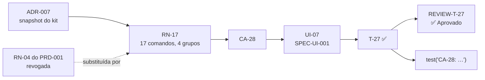

# Matriz de rastreabilidade — PRD-002 Site atualizado para o kit 0.3.1

- **PRD:** [`PRD-002-site-kit-0-3-1.md`](../prds/PRD-002-site-kit-0-3-1.md)
- **Plano:** [`PLAN-002-site-kit-0-3-1.md`](../plans/PLAN-002-site-kit-0-3-1.md)
- **SPEC-UI:** sem SPEC-UI própria — telas da [`SPEC-UI-001`](../prototype/SPEC-UI-001-landing-page.md) (UI-02, UI-07, UI-09, UI-11, UI-12)
- **ADRs:** ADR-007 (snapshot do kit), `Aceito`
- **Reviews:** `REVIEW-T-27`, `REVIEW-T-28` e `REVIEW-T-29` de 2026-10-07
- **Testes:** `tests/*.spec.ts`, nome no formato `test("CA-XX: …")`
- **Gerada por:** skill `sdd-trace` do MyAiToolKit (regras da 0.3.x), em 2026-10-07, depois da T-29

> A matriz é uma fotografia. Quando PRD ou plano mudarem, gere de novo.

## Resultado

**Nenhum elo quebrado.**

| Conjunto | Total | Ligado |
| --- | --- | --- |
| Regras (RN) | 3 | 3 com cenário e com tarefa |
| Cenários (CA) | 3 | 3 com tarefa e 3 com teste |
| Tarefas (T) | 3 | 3 `Concluído`, 3 com review |
| Apontamentos (R) | 0 | — |
| ADRs citados | 1 | existe e está `Aceito` |

### Tabela 1 — Da regra ao review

| RN | Regra (resumo) | Provada por (CA) | Feita em (T) | Decisão (ADR) | Review |
| --- | --- | --- | --- | --- | --- |
| RN-17 | 17 comandos do kit 0.3.1 em quatro grupos, com prévia (substitui a RN-04 do PRD-001) | CA-28 | T-27 | ADR-007 | T-27 ✅ |
| RN-18 | O kit nunca commita nem abre PR, dito no site | CA-29 | T-28 | — | T-28 ✅ |
| RN-19 | Textos do kit acompanham o snapshot (A–F no hero, contagens) | CA-30 | T-29 | ADR-007 | T-29 ✅ |

### Tabela 2 — Do cenário ao teste

| CA | Cenário | Prova (RN) | Tela (UI, da SPEC-UI-001) | Feito em (T) | Teste | Review |
| --- | --- | --- | --- | --- | --- | --- |
| CA-28 | Comandos do kit 0.3.1 em quatro grupos | RN-17 | UI-07 | T-27 | `tests/commands.spec.ts` | T-27 ✅ |
| CA-29 | O kit nunca commita | RN-18 | UI-07 | T-28 | `tests/commands.spec.ts` | T-28 ✅ |
| CA-30 | Textos do kit acompanham o snapshot | RN-19 | UI-02, UI-09, UI-11, UI-12 | T-29 | `tests/kit.spec.ts` | T-29 ✅ |

### Tabela 3 — Execução por tarefa

| Tarefa | Status no plano | Tem review? | Pior severidade | Apontamentos em aberto | Commit |
| --- | --- | --- | --- | --- | --- |
| T-27 | Concluído | Sim — `REVIEW-T-27-2026-10-07.md` | — | 0 | `61fa6be` |
| T-28 | Concluído | Sim — `REVIEW-T-28-2026-10-07.md` | — | 0 | `6bcd1d0` |
| T-29 | Concluído | Sim — `REVIEW-T-29-2026-10-07.md` | — | 0 | `dabc63a` |

### Diagrama

## Ligação com o PRD-001

- A RN-04 e o CA-14 do PRD-001 estão riscados, apontando para a RN-17 e o CA-28 daqui, e registrados com `−` na revisão 2 do PRD-001. O teste do CA-14 virou o do CA-28; nenhum teste cita ID revogado.
- A UI-07 da SPEC-UI-001 registra a mudança na revisão 2 dela.
- A matriz do PRD-001 foi gerada de novo junto com esta (`MATRIX-001-landing-page.md`).

## Observações (verificadas; não são elos quebrados)

- **Commits:** um por tarefa, feitos pelo agente com autorização do responsável (2026-10-07); cada hash entrou no histórico do plano no commit seguinte.
- **Numeração contínua:** RN-17…19, CA-28…30 e T-27…29 continuam a contagem do projeto (premissa do PLAN-002), então o `test("CA-XX: …")` e esta matriz nunca encontram IDs repetidos entre os dois PRDs.
