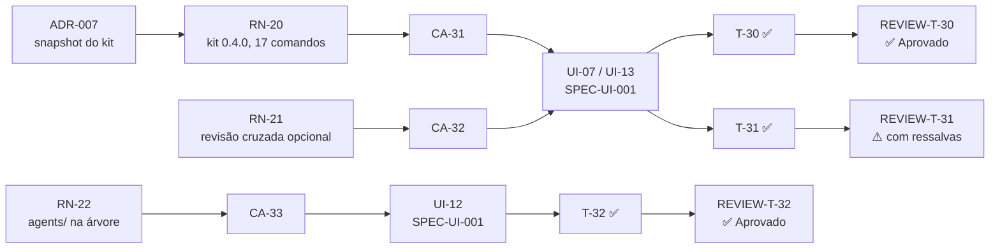

# Matriz de rastreabilidade — PRD-003 Site atualizado para o kit 0.4.0

- **PRD:** [`PRD-003-site-kit-0-4-0.md`](../prds/PRD-003-site-kit-0-4-0.md)
- **Plano:** [`PLAN-003-site-kit-0-4-0.md`](../plans/PLAN-003-site-kit-0-4-0.md)
- **SPEC-UI:** sem SPEC-UI própria — telas da [`SPEC-UI-001`](../prototype/SPEC-UI-001-landing-page.md) (UI-07, UI-12, UI-13), sem revisão
- **ADRs:** ADR-007 (snapshot do kit), `Aceito`
- **Reviews:** `REVIEW-T-30`, `REVIEW-T-31` e `REVIEW-T-32` de 2026-10-09
- **Testes:** `tests/*.spec.ts`, nome no formato `test("CA-XX: …")`
- **Gerada por:** skill `sdd-trace` do MyAiToolKit (regras da 0.4.0), em 2026-10-09, depois da T-32

> A matriz é uma fotografia. Quando PRD ou plano mudarem, gere de novo.

## Resultado

**Nenhum elo quebrado.**

| Conjunto | Total | Ligado |
| --- | --- | --- |
| Regras (RN) | 3 | 3 com cenário e com tarefa |
| Cenários (CA) | 3 | 3 com tarefa e 3 com teste |
| Tarefas (T) | 3 | 3 `Concluído`, 3 com review |
| Apontamentos (R) | 2 | 2 Sugestões, nenhum em aberto que bloqueie |
| ADRs citados | 1 | existe e está `Aceito` |
| IDs repetidos entre documentos | 0 | RN-20…22, CA-31…33 e T-30…32 só existem no PRD-003 e no PLAN-003 |

### Tabela 1 — Da regra ao review

| RN | Regra (resumo) | Provada por (CA) | Feita em (T) | Decisão (ADR) | Review |
| --- | --- | --- | --- | --- | --- |
| RN-20 | Snapshot do kit 0.4.0, os mesmos 17 comandos, sem chip para o verificador | CA-31 | T-30 | ADR-007 | T-30 ✅ Aprovado |
| RN-21 | Revisão cruzada opcional nos reviews e desligada por padrão no setup | CA-32 | T-31 | — | T-31 ⚠️ Aprovado com ressalvas — R-01, R-02 (REVIEW-T-31-2026-10-09), Sugestões |
| RN-22 | `agents/` com `review-verifier.md` na árvore do kit, depois de `skills/` | CA-33 | T-32 | — | T-32 ✅ Aprovado |

### Tabela 2 — Do cenário ao teste

| CA | Cenário | Prova (RN) | Tela (UI, da SPEC-UI-001) | Feito em (T) | Teste | Review |
| --- | --- | --- | --- | --- | --- | --- |
| CA-31 | Site no kit 0.4.0 | RN-20 | UI-07, UI-13 | T-30 | `tests/kit.spec.ts` | T-30 ✅ |
| CA-32 | Revisão cruzada opcional nos reviews | RN-21 | UI-07 | T-31 | `tests/commands.spec.ts` | T-31 ⚠️ (Sugestões) |
| CA-33 | Pasta agents/ na árvore do kit | RN-22 | UI-12 | T-32 | `tests/footer-open-source.spec.ts` | T-32 ✅ |

### Tabela 3 — Execução por tarefa

| Tarefa | Status no plano | Tem review? | Revisão cruzada | Pior severidade | Apontamentos em aberto | Commit |
| --- | --- | --- | --- | --- | --- | --- |
| T-30 | Concluído | Sim — `REVIEW-T-30-2026-10-09.md` | não acionada (sem candidatos) | — | 0 | `c17e04e` |
| T-31 | Concluído | Sim — `REVIEW-T-31-2026-10-09.md` | feita — 1 verificado, 1 confirmado (rebaixado a Sugestão) | Sugestão | R-01, R-02 (REVIEW-T-31-2026-10-09), opcionais | `a0373ae` |
| T-32 | Concluído | Sim — `REVIEW-T-32-2026-10-09.md` | não acionada (sem candidatos) | — | 0 | `4d421d8` |

### Diagrama

## Ligação com o PRD-001 e o PRD-002

- O PRD-003 não revoga nenhuma regra: a RN-17, a RN-18 e a RN-19 do PRD-002 continuam valendo (a 0.4.0 tem os mesmos 17 comandos) e os testes do CA-28, CA-29 e CA-30 continuam verdes com o snapshot 0.4.0. A RN-13 do PRD-001 passa a mostrar `0.4.0`.
- A SPEC-UI-001 não ganhou revisão: as três tarefas mudam só conteúdo de componentes que já existiam (cards da UI-07, item do `FileTree` da UI-12, versão da UI-13).
- O teste sem CA que fixava a 0.3.1 (`snapshot do kit 0.3.1 com 17 comandos`) virou o `CA-31`; as matrizes do PRD-001 e do PRD-002 não o citavam e continuam válidas sem nova geração.

## Observações (verificadas; não são elos quebrados)

- **Commits:** um por tarefa, depois do review, todos locais — nenhum push (o kit 0.4.0 ainda não está publicado no GitHub; decisão do responsável). Cada hash entrou no histórico do plano no commit seguinte; o da T-32, junto com esta matriz.
- **Revisão cruzada (dogfooding da 0.4.0):** os três reviews foram chamados com `cruzada`. Só o da T-31 teve candidato (um `Importante`); o verificador, um subagente novo e só de leitura, confirmou o problema e sugeriu severidade menor, e a evidência citada foi conferida antes de rebaixar. Nada foi descartado nem ficou em disputa.
- **Textos que envelheceram sem mentir:** o título do cenário CA-28 e o "Dado" do CA-30 do PRD-002 dizem "kit 0.3.1"; continuam verdadeiros para a 0.4.0 (mesmos 17 comandos) e não foram reabertos.
- **Bateria de testes:** 176 testes verdes com `npm test -- --workers=4`; com o número padrão de workers, falhas esporádicas de tempo em testes fora deste PRD (registrado no REVIEW-T-30).
