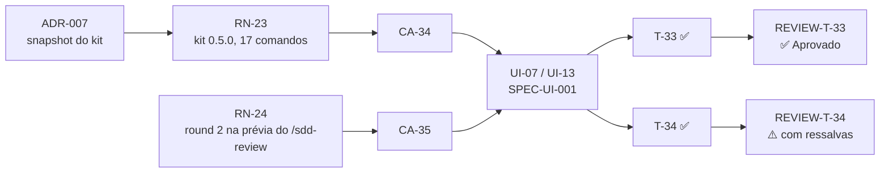

# Matriz de rastreabilidade — PRD-004 Site atualizado para o kit 0.5.0

- **PRD:** [`PRD-004-site-kit-0-5-0.md`](../prds/PRD-004-site-kit-0-5-0.md)
- **Plano:** [`PLAN-004-site-kit-0-5-0.md`](../plans/PLAN-004-site-kit-0-5-0.md)
- **SPEC-UI:** sem SPEC-UI própria — telas da [`SPEC-UI-001`](../prototype/SPEC-UI-001-landing-page.md) (UI-07, UI-13), sem revisão
- **ADRs:** ADR-007 (snapshot do kit), `Aceito`
- **Reviews:** `REVIEW-T-33` e `REVIEW-T-34` de 2026-10-09
- **Testes:** `tests/*.spec.ts`, nome no formato `test("CA-XX: …")`
- **Gerada por:** skill `sdd-trace` do MyAiToolKit (regras da 0.5.0), em 2026-10-09, depois da T-34

> A matriz é uma fotografia. Quando PRD ou plano mudarem, gere de novo.

## Resultado

**Nenhum elo quebrado.**

| Conjunto | Total | Ligado |
| --- | --- | --- |
| Regras (RN) | 2 | 2 com cenário e com tarefa |
| Cenários (CA) | 2 | 2 com tarefa e 2 com teste |
| Tarefas (T) | 2 | 2 `Concluído`, 2 com review |
| Apontamentos (R) | 1 | 1 Sugestão, nenhum em aberto que bloqueie |
| ADRs citados | 1 | existe e está `Aceito` |
| IDs repetidos entre documentos | 0 | RN-23…24, CA-34…35 e T-33…34 só existem no PRD-004 e no PLAN-004 |

### Tabela 1 — Da regra ao review

| RN | Regra (resumo) | Provada por (CA) | Feita em (T) | Decisão (ADR) | Review |
| --- | --- | --- | --- | --- | --- |
| RN-23 | Snapshot do kit 0.5.0, os mesmos 17 comandos, sem chip para o verificador (substitui a RN-20 do PRD-003) | CA-34 | T-33 | ADR-007 | T-33 ✅ Aprovado |
| RN-24 | Prévia do `/sdd-review` com um round 2 e a correção conferida; regra de idioma da prévia em inglês | CA-35 | T-34 | — | T-34 ⚠️ Aprovado com ressalvas — R-01 (REVIEW-T-34-2026-10-09), Sugestão |

### Tabela 2 — Do cenário ao teste

| CA | Cenário | Prova (RN) | Tela (UI, da SPEC-UI-001) | Feito em (T) | Teste | Review |
| --- | --- | --- | --- | --- | --- | --- |
| CA-34 | Site no kit 0.5.0 | RN-23 | UI-07, UI-13 | T-33 | `tests/kit.spec.ts` | T-33 ✅ |
| CA-35 | Correção conferida no round 2 do /sdd-review | RN-24 | UI-07 | T-34 | `tests/commands.spec.ts` | T-34 ⚠️ (Sugestão) |

### Tabela 3 — Execução por tarefa

| Tarefa | Status no plano | Tem review? | Revisão cruzada | Pior severidade | Apontamentos em aberto | Commit |
| --- | --- | --- | --- | --- | --- | --- |
| T-33 | Concluído | Sim — `REVIEW-T-33-2026-10-09.md` | não acionada (sem candidatos nem correções) | — | 0 | `9588b29` |
| T-34 | Concluído | Sim — `REVIEW-T-34-2026-10-09.md` | não acionada (só uma Sugestão; sem correções) | Sugestão | R-01 (REVIEW-T-34-2026-10-09), opcional | `0d420a8` |

### Diagrama

## Ligação com os PRDs anteriores

- **PRD-003, Revisão 1:** a RN-23 e o CA-34 substituem a RN-20 e o CA-31 (kit 0.4.0), riscados no PRD-003 e registrados com `−` na seção Revisões; a matriz do PRD-003 foi gerada de novo. O teste do CA-31 virou o do CA-34.
- A RN-21 e a RN-22 do PRD-003 continuam valendo: o CA-32 continua verde com a prévia nova do `/sdd-review`, e o "O que gera" segue dizendo que a revisão cruzada é opcional.
- A RN-17, a RN-18 e a RN-19 do PRD-002 continuam valendo (mesmos 17 comandos), e a RN-13 do PRD-001 passa a mostrar `0.5.0`.
- A Sugestão R-02 (REVIEW-T-31-2026-10-09) foi resolvida pela T-34 (regra de idioma na RN-24).
- A SPEC-UI-001 não ganhou revisão: as duas tarefas mudam só conteúdo de componentes que já existiam (prévia de um card da UI-07, versão da UI-13).

## Observações (verificadas; não são elos quebrados)

- **Commits:** um por tarefa, depois do review, todos locais — nenhum push (o kit 0.5.0 ainda não está publicado no GitHub; decisão do responsável). O hash da T-33 entrou no histórico no commit da T-34; o da T-34, junto com esta matriz.
- **Revisão cruzada (dogfooding da 0.5.0):** os dois reviews foram chamados com `cruzada`, mas nenhum teve o que verificar: o da T-33 não teve apontamentos e o da T-34 só uma Sugestão, que fica fora da verificação (`templates/cross-check.md`, seção 2); os dois são round 1, sem correções a conferir (seção 7). Nenhum verificador foi chamado — um pedido sem itens só renderia "Pedido incompleto". Os relatórios já trazem o campo `Commit revisado`, que um round 2 usaria.
- **Bateria de testes:** 178 testes verdes com `npm test -- --workers=4`.
